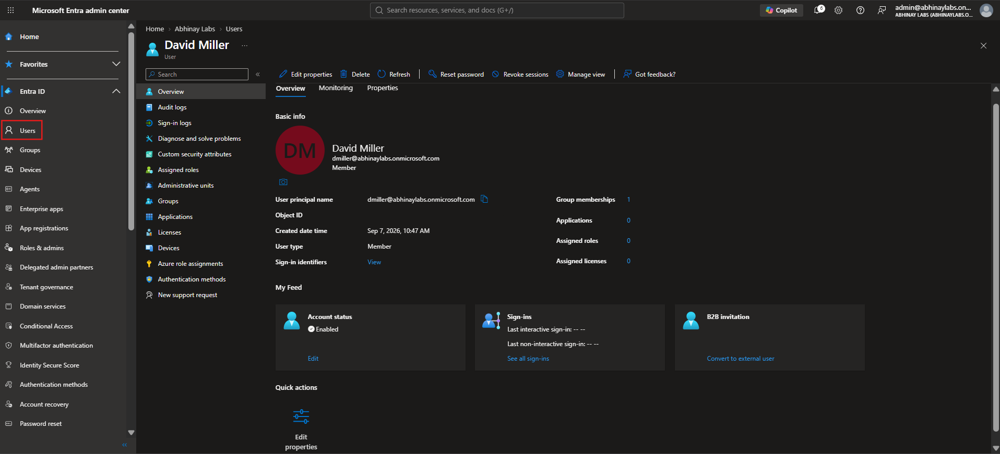
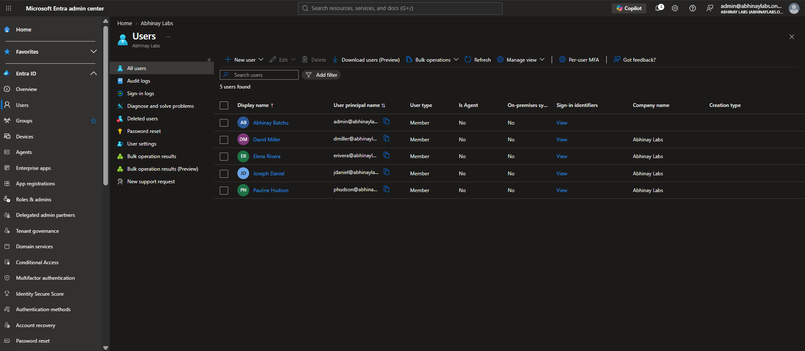

# Phase 3 — Cloud User Administration

## 1. Objective

The objective of this phase was to perform hands-on Microsoft Entra user administration using realistic synthetic employee identities.

The phase focused on the core user-management tasks commonly performed by Service Desk, IT Support, Microsoft 365 support, and junior identity administrators.

The work included:

- Creating Microsoft Entra cloud users
- Configuring organizational attributes
- Understanding account state
- Disabling and re-enabling a user
- Performing an administrative password reset
- Reviewing bulk administration capabilities
- Validating user type
- Validating Microsoft 365 licensing state
- Establishing a clean cloud-only identity baseline before later hybrid synchronization

---

## 2. Cloud User Administration

A **cloud user** is a user identity created and managed directly in Microsoft Entra ID.

At this stage of the project, the employee accounts were created directly in Microsoft Entra ID rather than synchronized from the existing on-premises Active Directory environment.

The initial identity model was:

```text
Microsoft Entra ID
        |
        +-- David Miller
        +-- Elena Rivera
        +-- Joseph Daniel
        +-- Pauline Hudson

Source:
Cloud-created

On-premises synchronization:
Not yet enabled
```

This allowed the cloud identity model to be learned independently before Microsoft Entra Connect Sync was introduced later in the project.

---

## 3. Synthetic Employee Identities

Four fictional employees were created to represent different business departments.

| Employee       | UPN                                   | Department             | Initial Job Title     |
| -------------- | ------------------------------------- | ---------------------- | --------------------- |
| David Miller   | `dmiller@abhinaylabs.onmicrosoft.com` | Human Resources        | HR Coordinator        |
| Elena Rivera   | `erivera@abhinaylabs.onmicrosoft.com` | Finance                | Financial Analyst     |
| Joseph Daniel  | `jdaniel@abhinaylabs.onmicrosoft.com` | Sales                  | Sales Representative  |
| Pauline Hudson | `phudson@abhinaylabs.onmicrosoft.com` | Information Technology | IT Support Technician |

The accounts were synthetic and created only for the Abhinay Labs environment.

---

## 4. User Principal Names

Each employee received a unique Microsoft Entra User Principal Name.

Examples:

```text
David Miller
dmiller@abhinaylabs.onmicrosoft.com

Elena Rivera
erivera@abhinaylabs.onmicrosoft.com

Joseph Daniel
jdaniel@abhinaylabs.onmicrosoft.com

Pauline Hudson
phudson@abhinaylabs.onmicrosoft.com
```

The UPN acted as the user's Microsoft cloud sign-in name.

Using consistent usernames also became important later when the project introduced hybrid identity and matched existing cloud users with corresponding on-premises Active Directory identities.

---

## 5. User Type

All four employees were created as:

```text
User type: Member
```

A Member identity represents an internal organizational user.

The lab did not use Guest identities for these employees because they represented fictional internal staff rather than external collaborators.

---

## 6. Organizational Attributes

The employee accounts were configured with organizational information to make the lab more realistic.

Common attributes included:

- Display name
- User Principal Name
- Job title
- Department
- Company
- Employee type
- Usage location

The common values used across the synthetic employee accounts included:

```text
Company:
Abhinay Labs

Employee type:
Employee

Usage location:
Canada
```

Organizational attributes are useful because they provide business context for identity administration.

They can also support:

- Reporting
- Access decisions
- Dynamic group rules
- Automation
- Identity lifecycle workflows
- Administrative troubleshooting

---

## 7. Initial Account State

The employee accounts were created as enabled Member identities.

The initial administrative model was:

```text
Account enabled:
Yes

User type:
Member

Source:
Cloud-created

Administrative role:
None
```

The employees were intentionally created without administrative privileges.

This followed the principle that normal employee identities should not receive elevated access unless their responsibilities require it.

---

## 8. Identity vs Microsoft 365 License

At the end of the initial user-creation phase, the employee identities existed in Microsoft Entra ID without automatically receiving Microsoft 365 service licenses.

The initial state was:

```text
Identity:
Created

Microsoft 365 license:
Not automatically assigned
```

This established an important distinction:

```text
User exists in Microsoft Entra ID
              ≠
User has Microsoft 365 services
```

Identity creation and Microsoft 365 licensing are separate administrative operations.

This distinction became the basis for later licensing and troubleshooting scenarios.

---

## 9. Account Enable and Disable

Microsoft Entra administrators can block a user from signing in without deleting the identity.

Conceptually:

```text
Enabled account
      |
      v
Can normally authenticate

Disabled account
      |
      v
Sign-in blocked

User object remains
```

This is different from deleting the account.

### Disable

Disabling an account retains the user object but prevents normal authentication.

### Delete

Deleting an account removes the user object and begins the Microsoft Entra deletion/recovery lifecycle.

The lab used account disabling as a controlled administrative test rather than deleting an employee identity.

---

## 10. Controlled Disable and Re-Enable Test

Joseph Daniel's account was used to practice account-state administration.

The workflow was:

```text
Verify user
    ↓
Disable account
    ↓
Validate account state
    ↓
Re-enable account
    ↓
Validate restored state
```

This demonstrated that account state can be changed independently of:

- Password
- Group membership
- Microsoft 365 licensing
- Administrative role assignment

The exercise also created useful context for later authentication troubleshooting, where a disabled account produced a Microsoft Entra sign-in failure.

---

## 11. Administrative Password Reset

David Miller's account was used to practice an administrative password reset.

An administrative password reset is appropriate when an authorized user cannot use their existing credential and the administrator has verified that the reset is legitimate.

The workflow was:

```text
Verify user identity/request
        ↓
Locate account
        ↓
Perform authorized password reset
        ↓
Provide temporary credential securely
        ↓
User changes password
        ↓
Validate successful authentication
```

The lab performed the technical administration portion of this workflow using a synthetic identity.

---

## 12. Password Reset vs Account Disable

Password reset and account disablement are different actions.

### Password Reset

Changes the user's authentication credential.

```text
Identity remains enabled
Password changes
```

### Account Disable

Blocks sign-in.

```text
Identity remains
Authentication blocked
```

An administrator should determine the actual problem before choosing either action.

For example:

```text
User says:
"I cannot sign in."

Possible causes:
- Wrong password
- Account disabled
- MFA issue
- Conditional Access
- Session issue
- Licensing issue
- Service issue
```

A password reset should not be the automatic response to every sign-in problem.

---

## 13. Bulk User Administration

Microsoft Entra ID provides bulk administration capabilities for managing multiple user identities.

During the lab, bulk administration and user export functionality were reviewed.

Bulk operations can be useful when organizations need to manage many identities rather than performing every action manually.

Examples may include:

- Bulk user creation
- Bulk deletion
- Bulk invite operations
- Bulk export
- Administrative reporting

The lab inspected these capabilities while keeping the actual identity population small and controlled.

Any exported CSV data used during administration was treated as private lab material rather than portfolio evidence.

---

## 14. User Validation

After user creation, the identities were reviewed to confirm that the expected configuration was present.

Validation included checking:

```text
Display name
UPN
User type
Department
Job title
Company
Employee type
Usage location
Account enabled state
License state
Administrative role state
```

This is important because successful creation of a user object does not guarantee that every required business attribute was configured correctly.

---

## 15. Initial Cloud-Only State

Before Microsoft Entra Connect Sync was introduced, these identities were managed directly in Microsoft Entra ID.

The identity flow was therefore:

```text
Administrator
      |
      v
Microsoft Entra ID
      |
      v
Cloud User Object
```

At this point:

```text
On-premises source of authority:
Not applicable to these cloud-created users

On-premises synchronization:
No
```

This later changed when selected users were matched with the existing Active Directory identities and brought under controlled hybrid synchronization.

---

## 16. Later Hybrid Identity Transition

The four employee accounts did not remain permanently cloud-only.

Later in the project, Microsoft Entra Connect Sync was implemented using a controlled pilot scope.

The existing cloud identities were matched with their corresponding on-premises Active Directory identities.

The later identity model became:

```text
On-Premises Active Directory
          |
          | Microsoft Entra Connect Sync
          v
Microsoft Entra ID
          |
          v
Existing Microsoft 365 identity preserved
```

This chronology is important.

The users were:

```text
Initially:
Cloud-created

Later:
Matched and synchronized through Microsoft Entra Connect
```

The project did not create a completely separate replacement cloud identity for each employee.

---

## 17. Attribute Source of Authority

Before hybrid synchronization, attributes such as job title and department could be administered directly in Microsoft Entra ID.

After hybrid synchronization was introduced, selected synchronized attributes became authoritative from the on-premises Active Directory side.

This later produced an important troubleshooting lesson:

```text
Cloud-only identity
      ↓
Cloud-managed attributes

Synchronized identity
      ↓
Some attributes sourced from on-premises AD
```

Administrators therefore need to determine whether an identity is cloud-only or synchronized before modifying an attribute.

---

## 18. Enterprise Relevance

User administration is one of the most common responsibilities in enterprise IT.

Typical requests include:

```text
"Create an account for a new employee."

"Update the user's department."

"Reset the user's password."

"Disable the employee's account."

"The employee changed roles."

"Verify whether the account is licensed."

"The user cannot sign in."
```

A support technician must understand that these requests may involve multiple independent identity properties and administrative actions.

---

## 19. IT Support Relevance

A practical IT Support workflow for user administration may include:

```text
Receive request
      ↓
Verify requester and authorization
      ↓
Identify the correct user
      ↓
Review current account state
      ↓
Perform approved change
      ↓
Validate result
      ↓
Document action
      ↓
Close or escalate
```

For account changes, support personnel should avoid:

- Modifying the wrong identity
- Assigning unnecessary privileges
- Deleting an account when disabling is sufficient
- Resetting passwords without verifying the user/request
- Assuming identity creation automatically includes licensing
- Making changes without validation

---

## 20. IAM Relevance

This phase introduced several important IAM principles.

### Identity Lifecycle

Users move through states such as:

```text
Created
Enabled
Modified
Disabled
Deleted
```

### Least Privilege

Standard employee identities were created without administrative roles.

### Identity Attributes

Job title, department, company, and other properties provide organizational context.

### Authentication Administration

Password resets directly affect authentication credentials.

### Account State

An account can be enabled or disabled independently from its group membership or licensing.

These concepts later became part of the Joiner-Mover-Leaver capstone.

---

## 21. Security Considerations

User administration affects access to organizational resources and should therefore be treated as a security-sensitive activity.

Important practices include:

- Verify authorization before modifying an account
- Avoid unnecessary administrative privileges
- Protect temporary credentials
- Do not expose passwords in screenshots or documentation
- Use disabling rather than immediate deletion when appropriate
- Validate the account after administrative changes
- Document significant identity changes
- Review suspicious or unexpected account-state changes

A malicious or accidental identity change can affect access to email, files, Teams, SharePoint, applications, and other organizational resources.

---

## 22. Evidence

### Figure 1 — Microsoft Entra Cloud User Profile

David Miller's Microsoft Entra profile demonstrates a synthetic Member identity configured in the Abhinay Labs tenant.



### Figure 2 — Cloud User Population

The Microsoft Entra user list shows the fictional employee identities created for Human Resources, Finance, Sales, and Information Technology.



---

## 23. Troubleshooting Principles

User administration should begin by identifying the actual identity state rather than immediately modifying credentials.

A useful sequence is:

```text
Correct user?
     ↓
Account enabled?
     ↓
Correct UPN?
     ↓
Authentication issue?
     ↓
Correct organizational attributes?
     ↓
Correct group memberships?
     ↓
Correct license?
     ↓
Correct administrative role?
     ↓
Cloud-only or synchronized?
```

This became increasingly important as the project expanded into licensing, RBAC, application support, and hybrid identity.

---

## 24. Key Lessons Learned

1. Microsoft Entra users can be created independently of Microsoft 365 licenses.
2. A User Principal Name is commonly used as the user's cloud sign-in identity.
3. Member accounts represent internal organizational users.
4. Organizational attributes provide important business context for identity administration.
5. Account enablement, password state, licensing, group membership, and administrative roles are separate properties.
6. Disabling an account blocks sign-in without immediately deleting the identity.
7. Password reset and account disablement solve different problems.
8. Standard employee accounts should not receive administrative roles unnecessarily.
9. Administrative changes should be followed by validation.
10. Bulk administration can improve efficiency when managing larger identity populations.
11. An administrator must determine whether an identity is cloud-only or synchronized before modifying authoritative attributes.
12. Establishing a clean cloud-only baseline made the later hybrid identity transition easier to understand and troubleshoot.

---

## 25. Phase Result

Phase 3 successfully established and validated the primary Microsoft Entra employee identities used throughout the project.

The phase demonstrated:

- Cloud user creation
- User Principal Name configuration
- Member identity administration
- Organizational attribute configuration
- Company and employee information
- Usage-location configuration
- Account enable/disable operations
- Administrative password reset
- Bulk administration review
- Identity-versus-license separation
- Standard-user least privilege
- Account-state validation
- Cloud-only identity administration
- Preparation for later hybrid identity synchronization

These users became the foundation for later Microsoft 365 licensing, Exchange Online, Teams, SharePoint, OneDrive, authentication troubleshooting, RBAC, Conditional Access, Graph PowerShell, and Microsoft Entra Connect Sync work.

**Phase 3 Status: COMPLETE**
