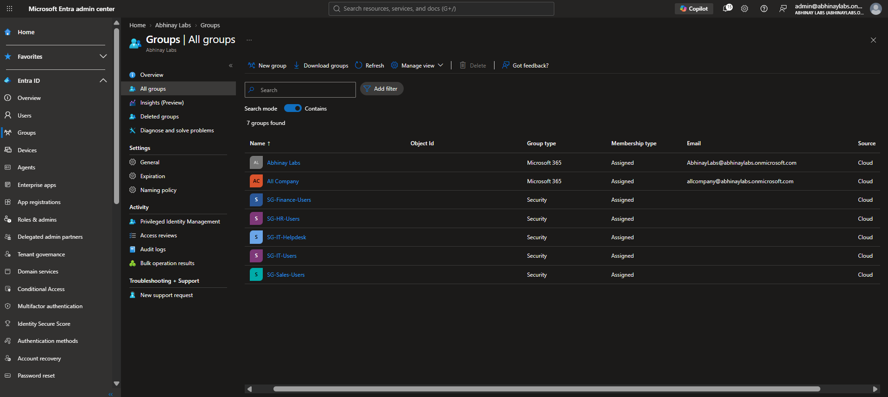
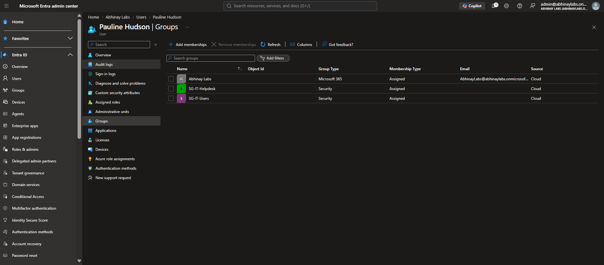

# Phase 4 — Groups & Access Management

## 1. Objective

The objective of this phase was to build a simple enterprise-style group structure in Microsoft Entra ID and understand how groups can be used to organize identities and support access management.

The phase focused on:

- Creating Microsoft Entra security groups
- Using assigned membership
- Organizing users by department and job function
- Understanding group-based access
- Distinguishing security groups from Microsoft 365 groups
- Distinguishing groups from administrative roles
- Understanding role-assignable groups conceptually
- Applying least-privilege principles
- Troubleshooting access through group membership

---

## 2. Why Groups Are Used

Managing permissions individually for every employee becomes difficult as an organization grows.

Instead of repeatedly assigning access directly to individual users, organizations commonly use groups.

Conceptually:

```text
User
  ↓
Security Group
  ↓
Resource / Access Assignment
```

Example:

```text
Elena Rivera
      ↓
SG-Finance-Users
      ↓
Finance Resource Access
```

This approach makes access easier to manage, review, and remove when an employee changes roles or leaves the organization.

---

## 3. Microsoft Entra Security Groups

A **security group** organizes users, devices, or other supported identities for access-control and administrative targeting scenarios.

The lab created the following security groups:

| Security Group     | Purpose                      | Initial Member |
| ------------------ | ---------------------------- | -------------- |
| `SG-HR-Users`      | Human Resources users        | David Miller   |
| `SG-Finance-Users` | Finance users                | Elena Rivera   |
| `SG-Sales-Users`   | Sales users                  | Joseph Daniel  |
| `SG-IT-Users`      | Information Technology users | Pauline Hudson |
| `SG-IT-Helpdesk`   | IT Help Desk personnel       | Pauline Hudson |

All groups used controlled assigned membership.

---

## 4. Group Naming Convention

The lab used:

```text
SG-
```

as the prefix for security groups.

Examples:

```text
SG-HR-Users
SG-Finance-Users
SG-Sales-Users
SG-IT-Users
SG-IT-Helpdesk
```

The names communicate both the group type and intended purpose.

For example:

```text
SG-Finance-Users
│          │
│          └── Finance users
│
└── Security Group
```

Clear naming helps administrators understand a group's purpose without opening every group individually.

---

## 5. Assigned Membership

The lab used **assigned membership**.

Assigned membership means an administrator explicitly adds or removes members.

Example:

```text
SG-HR-Users
     |
     +-- David Miller
```

Another example:

```text
SG-IT-Helpdesk
     |
     +-- Pauline Hudson
```

This provided a simple and predictable membership model for the small lab environment.

---

## 6. Dynamic Membership

A **dynamic group** automatically evaluates membership using rules based on supported identity attributes.

A conceptual example could be:

```text
Department = Finance
        ↓
Automatically include user
        ↓
Finance group
```

Dynamic groups were studied conceptually but were not required for this controlled lab.

The lab intentionally used assigned membership so that every access change could be performed and validated manually.

---

## 7. Department Groups

Each primary employee was placed into the security group representing their department.

### Human Resources

```text
David Miller
     ↓
SG-HR-Users
```

### Finance

```text
Elena Rivera
     ↓
SG-Finance-Users
```

### Sales

```text
Joseph Daniel
     ↓
SG-Sales-Users
```

### Information Technology

```text
Pauline Hudson
     ↓
SG-IT-Users
```

These groups represented a basic department-based access model.

---

## 8. Job-Function Group

Pauline Hudson also belonged to:

```text
SG-IT-Helpdesk
```

This group represented a **job function** rather than only a department.

Her membership model therefore became:

```text
Pauline Hudson
      |
      +-- SG-IT-Users
      |
      +-- SG-IT-Helpdesk
```

This demonstrates that a user may belong to multiple groups for different reasons.

For example:

```text
Department membership
        +
Job-function membership
        =
Combined organizational context
```

---

## 9. Security Group vs Microsoft 365 Group

Security groups and Microsoft 365 groups serve different primary purposes.

### Security Group

Primarily used for access-control and administrative targeting scenarios.

Examples from the lab:

```text
SG-HR-Users
SG-Finance-Users
SG-Sales-Users
SG-IT-Users
SG-IT-Helpdesk
```

### Microsoft 365 Group

Primarily supports Microsoft 365 collaboration services.

The tenant already contained Microsoft 365 groups such as:

```text
Abhinay Labs
All Company
```

These existing groups were left intact.

The lab created separate security groups instead of modifying unrelated default or existing collaboration groups.

---

## 10. Group vs Administrative Role

A security group does **not** automatically grant Microsoft Entra administrative privileges.

For example:

```text
Pauline Hudson
      ↓
SG-IT-Helpdesk
```

did not automatically make Pauline a Microsoft Entra Helpdesk Administrator.

The administrative role had to be assigned separately later.

The distinction is:

```text
Security Group
      ↓
Organizes identities / access

Administrative Role
      ↓
Grants administrative privileges
```

Therefore:

```text
SG-IT-Helpdesk membership
        ≠
Helpdesk Administrator role
```

This distinction is important because confusing a group with an administrative role can lead to incorrect assumptions about permissions.

---

## 11. Role-Assignable Groups

Microsoft Entra supports specially configured groups that can be used for Microsoft Entra role assignments.

These are known as **role-assignable groups**.

The lab did not enable this feature for the departmental security groups.

The groups created in this phase were normal security groups.

This was intentional because:

```text
Department group
        ≠
Administrative privilege group
```

Administrative privileges were handled separately using Microsoft Entra RBAC.

---

## 12. Group-Based Access Principle

A major principle in this phase was:

> Prefer group-based access where appropriate instead of assigning permissions individually to every employee.

For example:

```text
Elena Rivera
      ↓
SG-Finance-Users
      ↓
Finance resource
```

is preferable to repeatedly creating direct permissions such as:

```text
Finance resource
      ↓
Direct permission for Elena
```

when the access requirement is based on her organizational role.

Group-based access provides several advantages:

- Easier onboarding
- Easier offboarding
- Easier role changes
- More consistent permissions
- Better access review
- Reduced direct-permission sprawl
- Easier troubleshooting

---

## 13. Access Path

A useful way to troubleshoot access is to identify the complete access path.

Example:

```text
User
  ↓
Group Membership
  ↓
Group Assigned to Resource
  ↓
Effective Permission
```

In the later SharePoint scenario, this became:

```text
Elena Rivera
      ↓
SG-Finance-Users
      ↓
Finance Members
      ↓
Finance SharePoint Site
```

Removing Elena from the security group later broke that access path and created a controlled authorization failure.

That scenario was investigated in detail during the troubleshooting phase.

---

## 14. Authentication vs Group-Based Authorization

Group membership normally affects **authorization**, not the basic existence of the identity.

A user may successfully authenticate but still be denied access to a resource.

Conceptually:

```text
Authentication succeeds
        |
        v
User identity verified
        |
        v
Authorization evaluated
        |
        +-- Required group present → Access
        |
        +-- Required group missing → Denied
```

This distinction later became one of the most important troubleshooting lessons in the project.

---

## 15. Least Privilege

Group membership should provide only the access required for the employee's responsibilities.

For example:

```text
Finance user
      ↓
Finance access
```

does not imply:

```text
Finance user
      ↓
IT administrative privileges
```

Similarly:

```text
SG-IT-Helpdesk
```

was used to identify Help Desk personnel but did not automatically provide unrestricted tenant administration.

Administrative permissions were handled separately and tested using Microsoft Entra RBAC.

---

## 16. Group Ownership

The departmental security groups were created without unnecessary owners.

The lab used administrators to manage membership directly.

This kept the small lab environment simple while maintaining clear control over membership changes.

In a larger enterprise, group ownership may be delegated according to organizational policy and business requirements.

---

## 17. Existing Microsoft 365 Groups

The tenant already contained Microsoft 365 collaboration groups including:

```text
Abhinay Labs
All Company
```

These were not repurposed for the lab's departmental security model.

Instead, the lab maintained a clear separation:

```text
Existing collaboration groups
        |
        +-- Leave intact

Lab security groups
        |
        +-- Controlled access model
```

This avoided unnecessary changes to existing tenant objects.

---

## 18. Troubleshooting Group-Based Access

When a user cannot access a resource that should be controlled through group membership, a useful troubleshooting sequence is:

```text
Correct user?
      ↓
Account enabled?
      ↓
Correct group membership?
      ↓
Correct group assigned to resource?
      ↓
Correct permission level?
      ↓
License required?
      ↓
Authentication / access policy issue?
      ↓
Session or client state?
```

This prevents administrators from immediately changing passwords or creating direct permissions without first checking the actual authorization path.

---

## 19. Example Troubleshooting Scenario

A later Finance SharePoint scenario demonstrated this model.

Baseline:

```text
Elena Rivera
      ↓
SG-Finance-Users
      ↓
Finance Members
      ↓
Finance SharePoint
      ↓
Access Allowed
```

Controlled change:

```text
Elena removed from SG-Finance-Users
      ↓
Group-based authorization path removed
      ↓
SharePoint access denied
```

The correct remediation was to restore the approved group membership rather than create an unnecessary direct permission for Elena.

This preserved the intended access model.

---

## 20. Enterprise Relevance

Enterprise environments may contain hundreds or thousands of users.

Managing every employee's permissions individually would create administrative overhead and inconsistent access.

Groups provide a scalable model such as:

```text
Employee
   ↓
Department / Role Group
   ↓
Approved Resource
```

This model can support:

- File access
- SharePoint access
- Application access
- Policy targeting
- Licensing in supported scenarios
- Administrative delegation in appropriate designs

---

## 21. IT Support Relevance

Service Desk and IT Support technicians frequently troubleshoot tickets involving group membership.

Examples include:

```text
"I cannot access the Finance site."

"I joined the Sales department but still have HR access."

"I was added to the group but access is still denied."

"I changed departments and need new resources."

"The employee left the company but still appears in a group."
```

A technician should investigate:

```text
Identity
   ↓
Account state
   ↓
Group membership
   ↓
Resource assignment
   ↓
Effective permission
   ↓
Session / propagation
```

rather than immediately granting direct access.

---

## 22. IAM Relevance

Groups are a core Identity and Access Management mechanism.

This phase demonstrated several IAM principles.

### Role-Based Access

Access can be associated with business roles or departments.

### Least Privilege

Users should receive only the access required for their responsibilities.

### Access Lifecycle

Group memberships can change when employees join, move, or leave.

### Centralized Administration

Managing access through groups is generally easier to review than scattered direct permissions.

### Separation of Access and Administration

Being a member of a normal access group does not automatically provide administrative rights.

---

## 23. Security Considerations

Incorrect group membership can create security risk.

Examples include:

```text
User added to wrong department
        ↓
Unauthorized data access

Old group membership retained after transfer
        ↓
Privilege creep

Former employee retains group membership
        ↓
Unnecessary access remains
```

Important practices include:

- Verify authorization before adding users
- Remove obsolete memberships
- Avoid unnecessary direct permissions
- Follow least privilege
- Review privileged group membership carefully
- Validate access after changes
- Document significant access changes

---

## 24. Evidence

### Figure 3 — Microsoft Entra Security Groups

The Microsoft Entra group list shows the departmental and Help Desk security groups created for the Abhinay Labs access model.



### Figure 4 — Help Desk Group Membership

Pauline Hudson's membership in `SG-IT-Users` and `SG-IT-Helpdesk` demonstrates the use of separate department and job-function groups for the same employee.



---

## 25. Key Lessons Learned

1. Security groups provide a scalable way to organize users and manage access.
2. Assigned membership means administrators explicitly control who belongs to a group.
3. Department groups and job-function groups can represent different business requirements.
4. A user may require membership in multiple groups.
5. Microsoft 365 groups and security groups serve different primary purposes.
6. Group membership does not automatically grant Microsoft Entra administrative privileges.
7. `SG-IT-Helpdesk` membership and the Helpdesk Administrator role are separate concepts.
8. Role-assignable groups should not be enabled unless administrative role assignment through a group is actually required.
9. Group-based access is generally preferable to unnecessary direct user permissions.
10. Authentication and authorization are different layers of access.
11. Group membership should be reviewed during employee role changes to prevent privilege creep.
12. Access troubleshooting should follow the complete identity-to-resource authorization path.

---

## 26. Phase Result

Phase 4 successfully implemented a simple enterprise-style Microsoft Entra security-group model.

The phase demonstrated:

- Microsoft Entra security-group creation
- Assigned membership
- Department-based groups
- Job-function groups
- Security-group naming conventions
- Group-based access concepts
- Security groups versus Microsoft 365 groups
- Groups versus administrative roles
- Role-assignable group concepts
- Least privilege
- Authorization troubleshooting
- IAM access-management principles

The group structure created during this phase became the foundation for later Microsoft 365 resource-access testing, SharePoint authorization troubleshooting, Help Desk administration, and Joiner-Mover-Leaver workflows.

**Phase 4 Status: COMPLETE**
