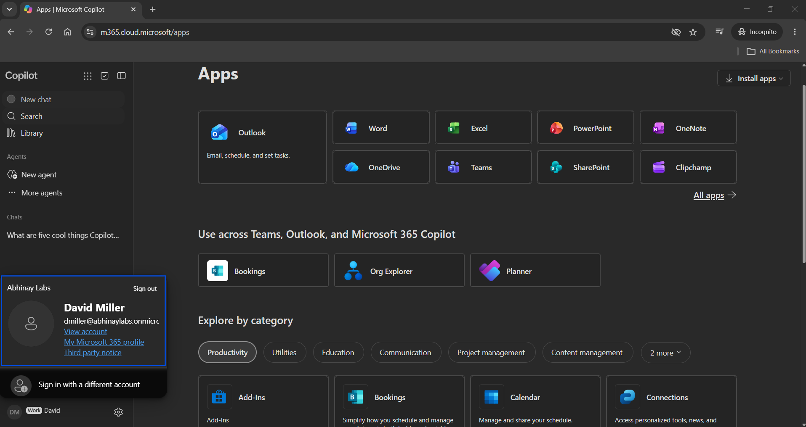

# Phase 5 — Microsoft 365 Licensing & Service Provisioning

## 1. Objective

The objective of this phase was to understand and validate the relationship between Microsoft Entra identities, Microsoft 365 licenses, individual service plans, backend service provisioning, and actual end-user access.

The phase focused on:

- Microsoft 365 license assignment
- Identity versus license separation
- Service-plan concepts
- Exchange Online mailbox provisioning
- First user sign-in
- Password-change workflow
- Microsoft 365 workload validation
- Email delivery testing
- Licensing and provisioning troubleshooting methodology

---

## 2. Identity vs License

A Microsoft Entra user identity can exist without a Microsoft 365 license.

This distinction is fundamental to Microsoft 365 administration.

Conceptually:

```text
Microsoft Entra Identity
        |
        +-- User exists
        |
        +-- May or may not have Microsoft 365 licensing
```

A user object alone does not automatically provide access to:

- Exchange Online
- Outlook
- Microsoft Teams
- OneDrive
- SharePoint
- Microsoft 365 applications

Therefore:

```text
Identity exists
        ≠
Microsoft 365 license assigned
```

---

## 3. Initial Licensing State

The synthetic employee identities were initially created separately from Microsoft 365 licensing.

During the controlled licensing test:

```text
David Miller
    ↓
Microsoft 365 Business Premium assigned
```

while other employee identities initially remained unlicensed.

This created a useful comparison between:

```text
Licensed cloud identity
        vs
Unlicensed cloud identity
```

The distinction later became important during troubleshooting when an unlicensed user could authenticate but could not use Outlook.

---

## 4. Microsoft 365 Business Premium

The lab used:

```text
Microsoft 365 Business Premium
```

Business Premium provides access to multiple Microsoft cloud capabilities through a single product license.

Relevant services used during the lab included:

- Exchange Online
- Microsoft Teams
- SharePoint Online
- OneDrive
- Microsoft 365 applications
- Microsoft Entra ID P1 capabilities

The product license contains individual service plans that enable specific services.

---

## 5. Service Plans

A **service plan** is an individual capability included within a Microsoft 365 product license.

Conceptually:

```text
Microsoft 365 Business Premium
        |
        +-- Exchange Online
        +-- Microsoft Teams
        +-- SharePoint Online
        +-- OneDrive
        +-- Microsoft 365 Apps
        +-- Other included services
```

This means Microsoft 365 licensing should not be understood as a single application entitlement.

It is a collection of service capabilities associated with the assigned subscription.

---

## 6. License Assignment

Microsoft 365 Business Premium was assigned to David Miller as the controlled test user.

The administrative flow was:

```text
Microsoft Entra user
        ↓
Usage location configured
        ↓
Microsoft 365 Business Premium assigned
        ↓
Included service plans become available
        ↓
Microsoft begins backend provisioning
```

The license assignment itself was only the beginning of the validation process.

The next step was to verify whether the required workloads were actually provisioned.

---

## 7. Licensing vs Provisioning

License assignment and service provisioning are related but different stages.

A useful model is:

```text
Identity
    ↓
License Assignment
    ↓
Service Entitlement
    ↓
Backend Provisioning
    ↓
Application Access
```

For example:

```text
David Miller
      ↓
Business Premium
      ↓
Exchange Online entitlement
      ↓
Mailbox provisioned
      ↓
Outlook accessible
```

An administrator should therefore avoid assuming:

```text
License assigned
      =
Everything immediately working
```

Validation is required.

---

## 8. Exchange Online Mailbox Provisioning

After David received Microsoft 365 Business Premium, Exchange Online provisioning was validated.

The Exchange Admin Center showed David as a:

```text
UserMailbox
```

for:

```text
dmiller@abhinaylabs.onmicrosoft.com
```

This proved that the process had progressed beyond simple identity creation.

The sequence was:

```text
Microsoft Entra identity
        ↓
Business Premium license
        ↓
Exchange Online entitlement
        ↓
Exchange mailbox provisioned
```

The mailbox could then be used through Outlook.

---

## 9. First User Sign-In

David's account was used to validate the end-user experience after service provisioning.

The first-sign-in workflow included:

```text
Temporary credential
        ↓
Microsoft 365 sign-in
        ↓
Required password change
        ↓
New user password
        ↓
Authenticated Microsoft 365 session
```

This simulated a common onboarding scenario in which an administrator provisions the account and the employee completes the initial credential-change process.

---

## 10. End-User Service Validation

The project did not stop after assigning the license.

David's Microsoft 365 services were tested from the user perspective.

Validated workloads included:

- Outlook
- Exchange Online mailbox
- Microsoft Teams
- OneDrive
- SharePoint
- Microsoft 365 applications page

The validation model was:

```text
License assigned?
      ↓
Service provisioned?
      ↓
User can authenticate?
      ↓
Application opens?
      ↓
Expected service works?
```

This is stronger evidence than simply showing that a license was assigned in an admin portal.

---

## 11. Authentication vs Service Access

Authentication and Microsoft 365 service access are separate layers.

A user may successfully authenticate to Microsoft Entra ID while still being unable to use a particular Microsoft 365 workload.

Conceptually:

```text
Successful authentication
        |
        v
Identity verified
        |
        +-- Correct license?
        +-- Required service plan?
        +-- Service provisioned?
        +-- Resource available?
```

Therefore:

```text
Successful sign-in
        ≠
Every Microsoft 365 service is available
```

This became especially important during the later unlicensed Outlook troubleshooting scenario.

---

## 12. MFA Context

Microsoft Authenticator was available as an authentication method within the tenant.

During the earlier stages of the project, authentication-method registration had not yet been completed for every synthetic employee.

Later in the project, all four synthetic employee users encountered Microsoft's required authentication-method/security-info registration flow and completed registration.

For Pauline Hudson, the requirement occurred after assignment of the privileged Microsoft Entra Helpdesk Administrator role.

David Miller, Elena Rivera, and Joseph Daniel also encountered a mandatory registration step later in the lab. However, the exact tenant policy or configuration that triggered registration for those standard users was not preserved as dedicated evidence, so the project does not attribute their prompts to a specific Conditional Access policy or Security Defaults state.

The important distinction is:

```text
Authentication method available in tenant
        ↓
Individual user registers authentication method
        ↓
Policy determines when additional authentication is required
```

Authentication-method availability, method registration, and MFA enforcement during a particular sign-in are related but separate concepts.

The broader authentication-method and MFA concepts were investigated in greater detail during the troubleshooting and security phases.

---
## 13. Test Email

After the Exchange mailbox was provisioned, email functionality was tested.

David successfully sent a message from the new organizational mailbox.

This validated that the Exchange Online mailbox was operational rather than merely visible in the administration portal.

The project also tested external delivery to a personal mailbox.

The message was delivered but was classified as spam by the external recipient.

---

## 14. Email Deliverability

Successful sending does not guarantee Inbox placement.

External email systems may evaluate multiple signals when deciding how to classify a message.

The lab used the default:

```text
abhinaylabs.onmicrosoft.com
```

Microsoft tenant domain.

This was sufficient for lab testing, but the project did not treat it as a production email-domain deployment.

The observed result was:

```text
Message sent
      ↓
External system received message
      ↓
Recipient filtering classified message as spam
```

This reinforced an important support distinction:

```text
Delivery
        ≠
Inbox placement
```

A message being placed in spam does not automatically mean Exchange Online failed to send it.

---

## 15. Why a Custom Domain Was Not Required

The purpose of this project was Microsoft 365 administration and IT Support practice.

Purchasing and configuring a custom public email domain would have added cost and setup work without materially improving the core learning objectives.

The tenant's default `onmicrosoft.com` domain was therefore retained for controlled lab testing.

This followed the project's principle of prioritizing practical administration skills over unnecessary environment polish.

---

## 16. Microsoft 365 Provisioning Troubleshooting Model

When a newly created user reports that a Microsoft 365 service does not work, a useful troubleshooting sequence is:

```text
Does the identity exist?
        ↓
Is the account enabled?
        ↓
Is usage location configured?
        ↓
Is the correct license assigned?
        ↓
Is the required service plan enabled?
        ↓
Has the backend service provisioned?
        ↓
Can the user authenticate?
        ↓
Can the application/service be accessed?
```

This sequence separates multiple possible causes rather than assuming that all failures are authentication problems.

---

## 17. Example — Outlook Provisioning

For a user who cannot access Outlook:

```text
User exists?
      ↓
Account enabled?
      ↓
Exchange-capable license assigned?
      ↓
Exchange Online service plan enabled?
      ↓
Mailbox exists?
      ↓
Authentication successful?
      ↓
Outlook accessible?
```

This flow later became directly useful when troubleshooting an unlicensed user.

---

## 18. License State as a Troubleshooting Layer

Licensing should be checked when:

- A user can sign in but a Microsoft 365 application is unavailable
- Outlook reports no mailbox
- Teams or another licensed workload is unavailable
- A newly provisioned service has not appeared
- A user recently changed license assignment
- Only one user is affected while the tenant service is healthy

It should not automatically be assumed that every Microsoft 365 issue is caused by licensing.

Instead, license state is one layer in the broader troubleshooting process.

---

## 19. Enterprise Relevance

Microsoft 365 licensing is a common Service Desk and IT administration responsibility.

Typical tickets may include:

```text
"New employee cannot access Outlook."

"User can sign in but Teams is unavailable."

"Mailbox does not appear after onboarding."

"Employee changed roles and needs a different license."

"User was offboarded and the license should be reclaimed."
```

These issues require administrators to understand both identity and service entitlement.

---

## 20. IT Support Relevance

A support technician should distinguish between:

```text
Identity problem
Authentication problem
Licensing problem
Provisioning problem
Application problem
Service-health problem
```

For example:

```text
User can sign into Microsoft 365
        |
        v
Outlook does not work
```

A technician should not immediately reset the password.

Instead:

```text
Verify user
    ↓
Check account state
    ↓
Check license
    ↓
Check Exchange mailbox
    ↓
Check service health
    ↓
Check application/session
```

This layered troubleshooting approach became one of the central themes of the project.

---

## 21. IAM Relevance

Licensing is separate from identity and authorization.

An identity lifecycle may therefore involve:

```text
Create identity
      ↓
Assign appropriate organizational attributes
      ↓
Assign approved access
      ↓
Assign required license
      ↓
Provision services
      ↓
Validate user access
```

During offboarding, the reverse may include:

```text
Disable access
      ↓
Preserve required business data
      ↓
Remove unnecessary access
      ↓
Reclaim license
```

This became part of the Joiner-Mover-Leaver capstone later in the project.

---

## 22. Security Considerations

Microsoft 365 licensing should follow legitimate business requirements.

Important practices include:

- Assign only required licenses
- Verify usage location before assignment where required
- Validate service provisioning
- Avoid granting unnecessary services
- Reclaim licenses when no longer required
- Preserve business data before removing access where policy requires it
- Verify authorization before changing a user's license
- Document licensing changes in enterprise support workflows

Licensing is both an operational and cost-management responsibility.

---

## 23. Evidence

### Figure 5 — Microsoft 365 Business Premium License Assignment

David Miller was assigned Microsoft 365 Business Premium as the controlled licensing test user.


### Figure 6 — Exchange Online Mailbox Provisioning

The Exchange Admin Center confirmed that David's Microsoft 365 licensing resulted in a provisioned Exchange Online user mailbox.


### Figure 7 — Microsoft 365 User Access

David successfully accessed Microsoft 365 services after licensing and provisioning were completed.



---

## 24. Interview Explanation

A concise interview explanation for this phase is:

> In my Microsoft 365 lab, I assigned Microsoft 365 Business Premium to a synthetic cloud user and validated the complete provisioning lifecycle instead of stopping at license assignment. I confirmed Exchange Online mailbox creation in the Exchange Admin Center, completed the user's initial sign-in and password-change workflow, and verified access to Outlook, Teams, OneDrive and SharePoint. The exercise helped me understand the difference between creating an identity, assigning a license, provisioning the underlying service and validating actual end-user access.

---

## 25. Key Lessons Learned

1. Microsoft Entra identity creation and Microsoft 365 licensing are separate operations.
2. A user can exist in Microsoft Entra ID without access to Microsoft 365 services.
3. Microsoft 365 product licenses contain individual service plans.
4. Assigning a license initiates service entitlement and provisioning but does not replace validation.
5. Exchange Online mailbox creation should be verified rather than assumed.
6. Successful authentication does not guarantee entitlement to every Microsoft 365 workload.
7. End-user service validation is required after licensing and provisioning.
8. Delivery of an email and Inbox placement are different outcomes.
9. A default `onmicrosoft.com` domain is sufficient for controlled lab testing and does not need to be treated as a production mail-domain design.
10. Licensing should be treated as one troubleshooting layer among identity, authentication, authorization, provisioning, service health, and application state.
11. License allocation and reclamation are important parts of employee lifecycle administration.
12. Support technicians should investigate the full provisioning chain instead of treating every Microsoft 365 failure as a password problem.

---

## 26. Phase Result

Phase 5 successfully demonstrated the Microsoft 365 licensing and service-provisioning lifecycle.

The phase included:

- Microsoft 365 Business Premium license assignment
- Identity-versus-license separation
- Service-plan concepts
- Exchange Online mailbox provisioning
- Initial user sign-in
- Password-change workflow
- Outlook validation
- Teams validation
- OneDrive validation
- SharePoint validation
- Email delivery testing
- Microsoft 365 troubleshooting methodology
- Enterprise licensing concepts

The phase established the service foundation required for the more advanced troubleshooting scenarios performed later in the project.

**Phase 5 Status: COMPLETE**

