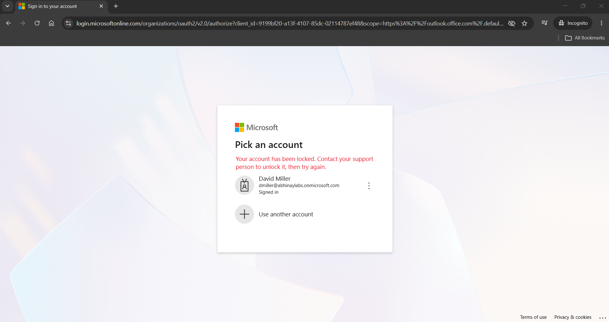
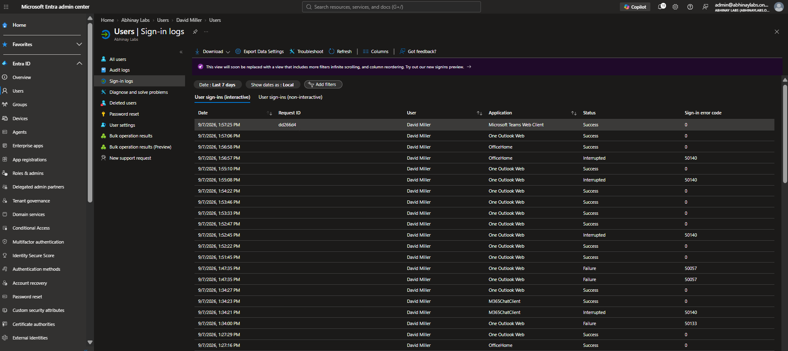
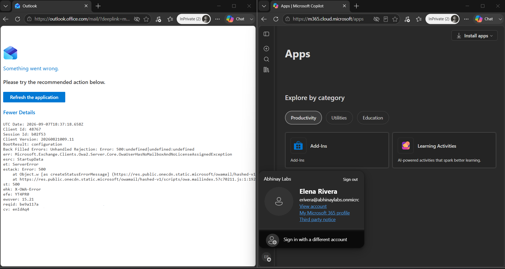
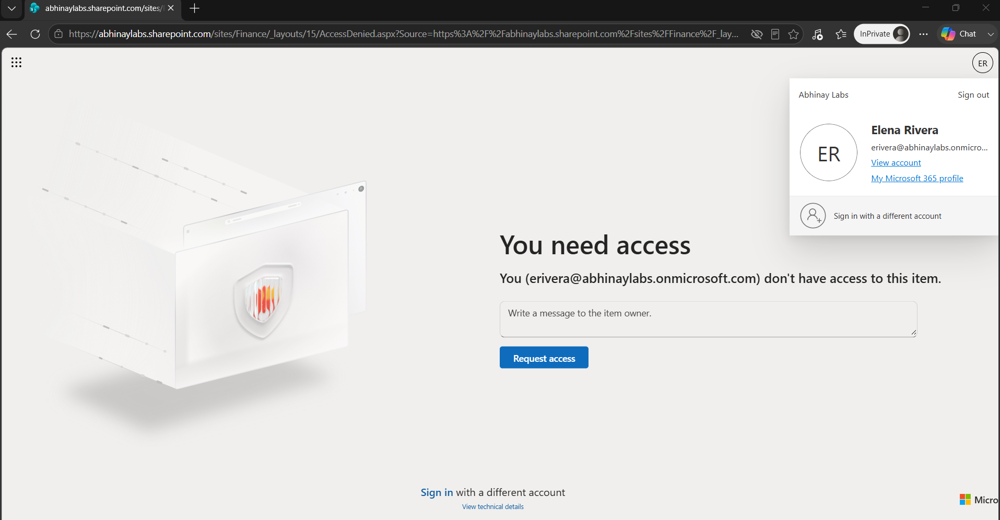
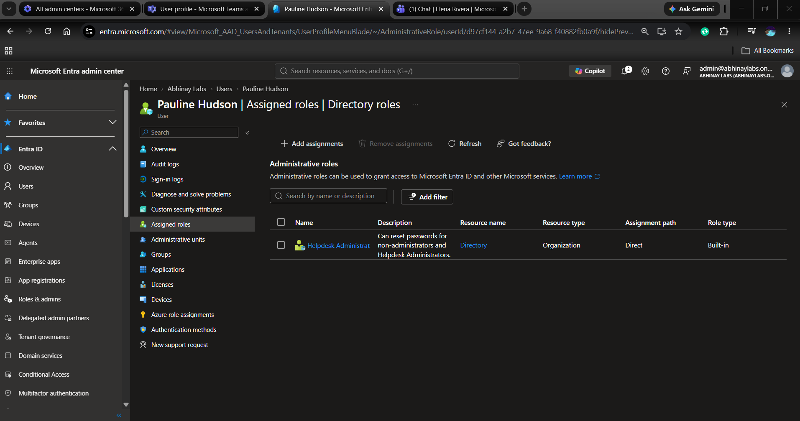

# Phase 6 — Microsoft 365 User Support, Troubleshooting & Least-Privilege Administration

## 1. Objective

The objective of this phase was to move beyond basic Microsoft 365 administration and practice realistic user-support and troubleshooting scenarios.

The phase focused on:

- Password support
- Account enable/disable behavior
- Authentication troubleshooting
- Microsoft Entra sign-in logs
- Microsoft 365 licensing problems
- Exchange Online mailbox support
- Mail forwarding
- SharePoint authorization troubleshooting
- Group-based access
- Browser and session troubleshooting
- Authentication-method administration
- MFA concepts
- Microsoft Entra RBAC
- Helpdesk Administrator
- Least-privilege validation

The goal was not simply to make a user account work.

The goal was to identify the correct problem layer before applying remediation.

---

## 2. Troubleshooting Mindset

A Microsoft 365 user may report:

```text
"I cannot sign in."

"Outlook is not working."

"I cannot access the Finance site."

"My Microsoft 365 session keeps asking me to authenticate."

"I need my password reset."
```

These symptoms can originate from different layers.

A useful troubleshooting model is:

```text
Identity
   ↓
Account State
   ↓
Authentication
   ↓
Authorization
   ↓
Licensing
   ↓
Service Provisioning
   ↓
Policy
   ↓
Session / Client
   ↓
Microsoft Service Health
```

The phase reinforced an important principle:

> Do not automatically reset a password whenever a user reports that they cannot sign in.

The actual cause should be investigated first.

---

## 3. Password Support

David Miller's account was used to practice administrative password support.

The workflow included:

```text
Verify the user/request
        ↓
Locate the correct identity
        ↓
Reset password
        ↓
Temporary credential provided
        ↓
User changes password
        ↓
Validate authentication
```

The lab emphasized that password resets should be performed only after the identity and request are verified.

---

## 4. Password Reset vs Account Disable

Password reset and account disablement are different administrative actions.

### Password Reset

Changes the user's authentication credential.

```text
User remains enabled
        ↓
Password changes
```

### Account Disable

Blocks normal sign-in.

```text
User object remains
        ↓
Authentication blocked
```

A user who cannot sign in may therefore require investigation rather than an immediate password reset.

---

## 5. David Miller — Authentication Troubleshooting Scenario

David Miller's account was used for a controlled authentication troubleshooting scenario.

During testing, Microsoft 365 applications displayed inconsistent user-facing symptoms.

Observed behavior included:

- Microsoft 365 web access succeeding at some points
- Outlook requiring authentication
- Teams and Outlook failing during part of the scenario
- A user-facing locked/account-access message
- Mixed successful, interrupted, and failed sign-in events

Rather than assuming the password was incorrect, the Microsoft Entra sign-in logs were reviewed.

---

## 6. Microsoft Entra Sign-In Logs

Microsoft Entra sign-in logs record authentication activity and provide diagnostic information such as:

- User
- Application
- Time
- Status
- Authentication requirement
- Error code
- Failure reason
- Conditional Access information

These logs are useful because a user-facing message may only describe the symptom.

The administrative log may provide a more specific recorded cause.

---

## 7. Error 50057

A detailed Outlook sign-in event for David recorded:

```text
Error Code:
50057

Failure Reason:
The user account is disabled.
```

The application was:

```text
Office / Outlook Web
```

This provided a clear root cause for that specific authentication event.

The troubleshooting relationship was:

```text
User reports sign-in failure
        ↓
Review Microsoft Entra sign-in logs
        ↓
Locate failed authentication
        ↓
Error 50057
        ↓
User account disabled
```

This demonstrated why administrators should investigate identity and account state before changing credentials.

---

## 8. Account-State Validation

When a sign-in problem occurs, account state should be checked early in the investigation.

A useful sequence is:

```text
Correct user?
      ↓
Account enabled?
      ↓
Correct credential?
      ↓
Authentication method issue?
      ↓
Conditional Access issue?
      ↓
Session issue?
      ↓
Application issue?
```

An account-disabled condition should be remediated only when re-enabling the account is authorized.

---

## 9. User-Facing Symptom vs Recorded Cause

A major lesson from this scenario was:

```text
User-facing message
        =
Symptom

Microsoft Entra sign-in log
        =
Administrative evidence
```

The user may report:

```text
"Outlook won't let me sign in."
```

but the administrator should investigate the actual recorded authentication state.

This avoids troubleshooting based only on assumptions.

---

## 10. Elena Rivera — Unlicensed Outlook Scenario

Elena Rivera was used to demonstrate the difference between successful authentication and Microsoft 365 service entitlement.

At the beginning of the scenario, Elena existed as a valid Microsoft Entra identity but did not have the required Microsoft 365 license.

She could authenticate to Microsoft 365.

However, Outlook failed.

The error included:

```text
Microsoft.Exchange.Clients.Owa2.Server.Core.
OwaUserHasNoMailboxAndNoLicenseAssignedException
```

This demonstrated that authentication was not the problem.

---

## 11. Root Cause — License and Mailbox

The troubleshooting path was:

```text
Identity exists
      ↓
Account enabled
      ↓
Authentication successful
      ↓
Outlook fails
      ↓
Check Microsoft 365 license
      ↓
No appropriate license
      ↓
No Exchange Online mailbox
```

The issue therefore belonged to the licensing/service-provisioning layer.

This was different from David's disabled-account scenario.

---

## 12. Licensing Troubleshooting Principle

The Elena scenario established:

```text
Successful authentication
        ≠
Microsoft 365 service entitlement
```

A technician troubleshooting Outlook should therefore consider:

```text
Identity
   ↓
Account Status
   ↓
License
   ↓
Exchange Service Plan
   ↓
Mailbox Provisioning
   ↓
Authentication
   ↓
Client / Service
```

Resetting Elena's password would not have resolved the underlying problem.

---

## 13. Exchange Online Mailbox Support

Once appropriate licensing and service provisioning were available, Exchange Online functionality could be validated.

Common Exchange support checks include:

- Does the user have the correct license?
- Is the Exchange Online service plan enabled?
- Does the mailbox exist?
- Can the user authenticate?
- Is there a Microsoft service incident?
- Are mailbox settings affecting mail flow?

This provided the foundation for the mailbox-forwarding scenario.

---

## 14. Mail Forwarding

Elena's mailbox was used to practice internal Exchange Online forwarding.

The forwarding configuration was:

```text
Elena Rivera mailbox
        ↓
Forward messages to David Miller
        ↓
Retain a copy in Elena's mailbox
```

The configuration was tested and validated.

After testing, forwarding was disabled.

A second validation confirmed that the temporary forwarding configuration had been removed.

---

## 15. Security Relevance of Forwarding

Mailbox forwarding can be legitimate.

Examples include:

- Temporary employee absence
- Business continuity
- Approved role transition
- Authorized mailbox management

However, unexpected forwarding can also indicate account compromise.

An attacker with mailbox access may configure forwarding to maintain visibility into organizational email.

Therefore, unexpected forwarding should be investigated.

A support technician should verify:

```text
Who requested the change?
      ↓
Was it authorized?
      ↓
What destination is configured?
      ↓
Should the user retain a copy?
      ↓
Is the forwarding still required?
```

---

## 16. SharePoint Group-Based Authorization

A Finance SharePoint site was used to test group-based authorization.

The approved access path was:

```text
Elena Rivera
      ↓
SG-Finance-Users
      ↓
Finance Members
      ↓
Finance SharePoint Site
```

Elena initially had access through the intended group-based model.

---

## 17. Controlled SharePoint Access Failure

To create a controlled troubleshooting scenario, Elena was removed from:

```text
SG-Finance-Users
```

The SharePoint site retained its group-based permission configuration.

The result was:

```text
Elena authenticates successfully
        ↓
Required group membership missing
        ↓
Authorization fails
        ↓
"You need access"
```

This was a deliberate authorization failure.

---

## 18. Check Permissions

SharePoint's permission-checking functionality was used to investigate Elena's effective access.

After removal from the Finance security group, the permission check showed that Elena had:

```text
None
```

for the Finance resource.

This confirmed that the problem was authorization rather than authentication.

---

## 19. Access Request

Elena used the SharePoint access-request mechanism after access was denied.

The request reached the appropriate site ownership workflow.

The request was not used to create an unnecessary direct user permission.

Instead, the lab retained the intended access model:

```text
User
  ↓
Security Group
  ↓
SharePoint Permission
```

The appropriate remediation was to restore Elena's authorized Finance-group membership.

---

## 20. Restoring Group-Based Access

Elena was restored to:

```text
SG-Finance-Users
```

The backend authorization path was therefore corrected.

However, SharePoint access did not immediately recover in the existing browser session.

This introduced a second troubleshooting layer.

---

## 21. Browser and Session Troubleshooting

After the group membership was corrected, the troubleshooting sequence was:

```text
Restore group membership
        ↓
Retry access
        ↓
Still denied
        ↓
Sign out / sign in
        ↓
Still denied
        ↓
Clear SharePoint site cookies
        ↓
Retry
        ↓
Access restored
```

This demonstrated an important troubleshooting principle:

> Fix the actual server-side identity or authorization configuration first. Use browser or session cleanup only after the backend configuration is correct.

Clearing cookies first would not have restored the missing group membership.

---

## 22. Backend Cause vs Client State

The SharePoint scenario contained two distinct problems at different stages.

### Stage 1 — Authorization

```text
Finance group membership missing
        ↓
No effective permission
```

### Stage 2 — Client / Session State

```text
Group membership restored
        ↓
Backend access correct
        ↓
Browser session still reflects stale state
```

This demonstrates why troubleshooting may continue even after the original configuration error has been corrected.

---

## 23. Authentication Method Policy

The Microsoft Entra authentication-method configuration was reviewed.

An authentication-method policy determines which methods users may be permitted to register or use.

Examples include supported methods such as Microsoft Authenticator.

A key distinction is:

```text
Authentication method enabled in tenant
        ≠
Method registered for every user
```

The tenant-level policy controls availability.

Individual users still require their own method registration.

---

## 24. MFA

Multi-Factor Authentication requires more than one authentication factor.

Common categories include:

```text
Something you know
        +
Something you have
        or
Something you are
```

In the lab, MFA and authentication-method administration were reviewed as part of Microsoft Entra support.

After Pauline Hudson received the privileged **Helpdesk Administrator** role, she was required to complete Microsoft's MFA/authentication-method registration flow for the privileged account.

The other synthetic employee users also encountered a mandatory authentication-method/security-info registration step later in the project and completed registration. However, the exact policy or tenant setting that triggered registration for those standard users was not preserved as dedicated evidence.

Therefore, the project does not incorrectly attribute every user's registration prompt to Pauline's administrative role, Security Defaults, or the Finance Conditional Access policy.

This reinforced two important principles:

```text
Privileged identity
        ↓
Requires stronger authentication protection
```

and:

```text
Authentication-method registration
        ≠
Proof that the same MFA policy is enforced
for every user and every sign-in
```

---
## 25. Microsoft Entra RBAC

Microsoft Entra uses Role-Based Access Control to grant administrative capabilities.

Rather than providing the synthetic IT Support user with unrestricted tenant administration, Pauline Hudson was assigned:

```text
Helpdesk Administrator
```

She was not assigned:

```text
Global Administrator
```

This created a realistic delegated-support model.

---

## 26. Helpdesk Administrator

The Helpdesk Administrator role provided support-oriented administrative capabilities while maintaining restrictions against higher-privilege tenant administration.

The lab used Pauline Hudson as the synthetic Help Desk administrator.

Her administrative identity represented:

```text
IT Support user
      ↓
Helpdesk Administrator
      ↓
Approved support capabilities
```

rather than:

```text
IT Support user
      ↓
Global Administrator
```

---

## 27. Group Membership vs Administrative Role

Pauline already belonged to:

```text
SG-IT-Helpdesk
```

However:

```text
SG-IT-Helpdesk membership
        ≠
Helpdesk Administrator role
```

The security group represented organizational/job-function membership.

The Microsoft Entra role provided administrative permissions.

This separation prevented the lab from incorrectly assuming that a normal security group granted administrative privileges.

---

## 28. Least-Privilege Validation

The Helpdesk Administrator role was tested to verify both permitted and restricted operations.

The lab confirmed support functionality such as password-related administration for appropriate users.

The role was also tested against higher-privilege administrative operations.

Observed boundaries included:

```text
Support-oriented password administration:
Allowed

Assign Global Administrator:
Denied

Assign additional Helpdesk Administrator role:
Denied
```

The purpose was to validate that the delegated role did not provide unrestricted administrative control.

---

## 29. Why Least Privilege Matters

Least privilege means:

> Give an identity only the permissions required for its responsibilities.

A Service Desk technician may need to:

- Reset passwords
- Assist users with authentication
- Review basic user information
- Perform supported Help Desk operations

That does not mean the technician should automatically be able to:

- Assign Global Administrator
- Change high-privilege tenant roles
- Perform unrestricted tenant administration

Reducing privilege lowers the impact of:

- Account compromise
- Human error
- Unauthorized changes
- Credential theft

---

## 30. Troubleshooting Scenario Comparison

The phase demonstrated several different problems that could initially appear similar to an end user.

### Scenario A — David

```text
Symptom:
Cannot use Outlook / sign-in failure

Cause:
Account disabled

Evidence:
Microsoft Entra sign-in log
Error 50057
```

### Scenario B — Elena Outlook

```text
Symptom:
Outlook unavailable

Authentication:
Successful

Cause:
No appropriate Microsoft 365 license / mailbox
```

### Scenario C — Elena SharePoint

```text
Symptom:
Finance site access denied

Authentication:
Successful

Cause:
Required group membership removed
```

### Scenario D — SharePoint After Remediation

```text
Backend authorization:
Restored

Remaining symptom:
Browser still denied access

Cause:
Stale client/session state

Resolution:
Clear SharePoint site cookies
```

These scenarios demonstrate why user symptoms alone are not sufficient to identify root cause.

---

## 31. Structured Microsoft 365 Troubleshooting Flow

A practical support workflow is:

```text
1. Verify the correct user and reported issue
              ↓
2. Determine scope and impact
              ↓
3. Check account state
              ↓
4. Check authentication evidence
              ↓
5. Check authorization / group membership
              ↓
6. Check licensing and service provisioning
              ↓
7. Check policy
              ↓
8. Check client / session state
              ↓
9. Check Microsoft Service Health when appropriate
              ↓
10. Apply authorized remediation
              ↓
11. Validate from the user perspective
              ↓
12. Document the result
```

This sequence is more reliable than changing multiple settings without first identifying the problem layer.

---

## 32. Enterprise Relevance

These scenarios reflect common enterprise Service Desk tickets.

Examples include:

```text
"User cannot sign into Outlook."

"User has access to Microsoft 365 but no mailbox."

"Employee lost access to the Finance site."

"Permission was restored but the browser still shows access denied."

"Please configure temporary mailbox forwarding."

"Help Desk needs password-reset capability."
```

A technician must be able to distinguish authentication, authorization, licensing, service provisioning, and client-state problems.

---

## 33. IT Support Relevance

This phase directly practiced common IT Support responsibilities:

- Account support
- Password administration
- Sign-in investigation
- Microsoft 365 license troubleshooting
- Exchange mailbox support
- Mail forwarding
- SharePoint access troubleshooting
- Group-membership investigation
- Effective-permission checking
- Browser/session troubleshooting
- Authentication-method support
- MFA concepts
- Delegated administration
- Least-privilege validation

The scenarios required both technical troubleshooting and validation from the end-user perspective.

---

## 34. Security and IAM Relevance

Several security and IAM concepts were demonstrated.

### Authentication

Determines whether the user can prove their identity.

### Authorization

Determines what the authenticated user can access.

### Licensing

Determines entitlement to supported Microsoft 365 services.

### RBAC

Administrative privileges are granted according to assigned roles.

### Least Privilege

Help Desk personnel receive only the administrative capability required for their work.

### Group-Based Access

Resource permissions are managed through approved security groups where appropriate.

### MFA

Privileged identities benefit from stronger authentication controls.

---

## 35. Evidence

### Figure 8 — Blocked User Sign-In

A controlled disabled-account state produced an authentication failure for the synthetic user.



### Figure 9 — Microsoft Entra Sign-In Log Troubleshooting

Microsoft Entra sign-in logs provided authentication evidence, including error `50057`, identifying the disabled-account condition.



### Figure 10 — Unlicensed Outlook Error

Elena Rivera authenticated successfully but Outlook failed because the user lacked the required license and Exchange Online mailbox.



### Figure 11 — SharePoint Access Denied

Removing Elena from the approved Finance security group broke the group-based authorization path and produced a controlled SharePoint access-denied condition.



### Figure 12 — Helpdesk Administrator Role

Pauline Hudson received the Microsoft Entra Helpdesk Administrator role to demonstrate delegated administration without granting Global Administrator.



---

## 36. Interview Explanation

A concise interview explanation for this phase is:

> In my Microsoft 365 and Entra lab, I practiced user account and password administration, licensing and Exchange mailbox provisioning, SharePoint group-based authorization, mailbox forwarding, authentication-method administration, sign-in-log analysis, and least-privilege RBAC. For example, I investigated an Outlook authentication failure using Microsoft Entra sign-in logs, where error 50057 identified a disabled account. I also reproduced a separate Outlook issue where the user could authenticate but had no Exchange mailbox because the required Microsoft 365 license was missing. For SharePoint, I intentionally removed a Finance user's approved group membership, verified that effective permissions were lost, restored the correct group-based access, and then resolved remaining stale browser state. Finally, I delegated the Helpdesk Administrator role to an IT Support identity and validated both its support capability and its restrictions against higher-privilege role assignment.

---

## 37. Key Lessons Learned

1. A user-facing sign-in error is a symptom; Microsoft Entra logs can provide stronger administrative evidence.
2. Error `50057` can identify a disabled-account condition.
3. Password reset, account disablement, and authentication troubleshooting are separate administrative actions.
4. Successful authentication does not guarantee Microsoft 365 service entitlement.
5. An unlicensed user can exist and authenticate while still lacking an Exchange Online mailbox.
6. Authentication and authorization are different layers.
7. SharePoint access should be troubleshot through the complete user-to-group-to-resource permission path.
8. Restoring the backend permission does not always immediately refresh client/session state.
9. Browser cleanup should follow correction of the actual server-side configuration rather than replace it.
10. Mail forwarding should be treated as both a business-support feature and a potential security indicator.
11. Tenant authentication-method policy and individual authentication-method registration are different concepts.
12. Security-group membership does not automatically grant Microsoft Entra administrative privileges.
13. Help Desk administration should follow least privilege instead of assigning Global Administrator.
14. Administrative-role testing should validate both what the role can do and what it cannot do.
15. Microsoft 365 troubleshooting should separate identity, account state, authentication, authorization, licensing, provisioning, policy, session state, and service health.

---

## 38. Phase Result

Phase 6 successfully demonstrated realistic Microsoft 365 user-support, troubleshooting, and delegated-administration workflows.

The phase included:

- Administrative password support
- Account enable/disable troubleshooting
- Microsoft Entra sign-in-log investigation
- Error `50057` analysis
- License and mailbox troubleshooting
- Exchange Online support
- Mail-forwarding configuration and removal
- SharePoint group-based authorization
- Controlled access-denied testing
- Effective-permission validation
- Access-request workflow
- Browser and session troubleshooting
- Authentication-method administration
- MFA concepts
- Microsoft Entra RBAC
- Helpdesk Administrator assignment
- Least-privilege testing
- Structured enterprise troubleshooting methodology

This phase established several of the strongest practical troubleshooting stories in the overall project.

**Phase 6 Status: COMPLETE**

