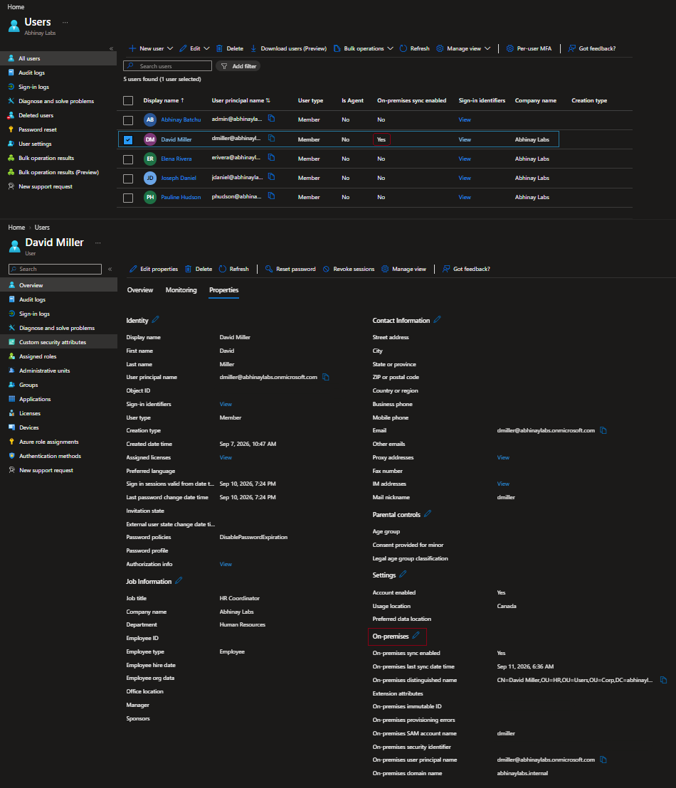
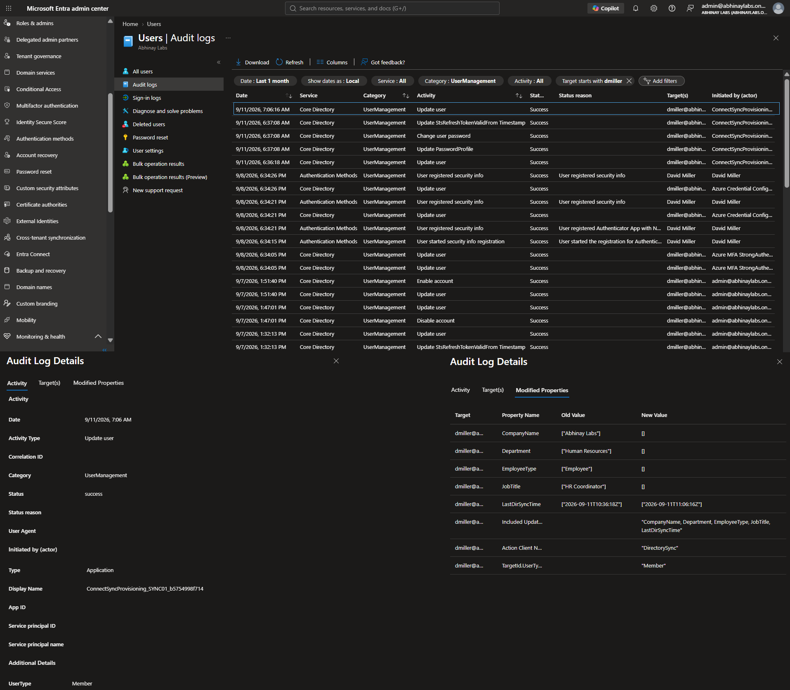
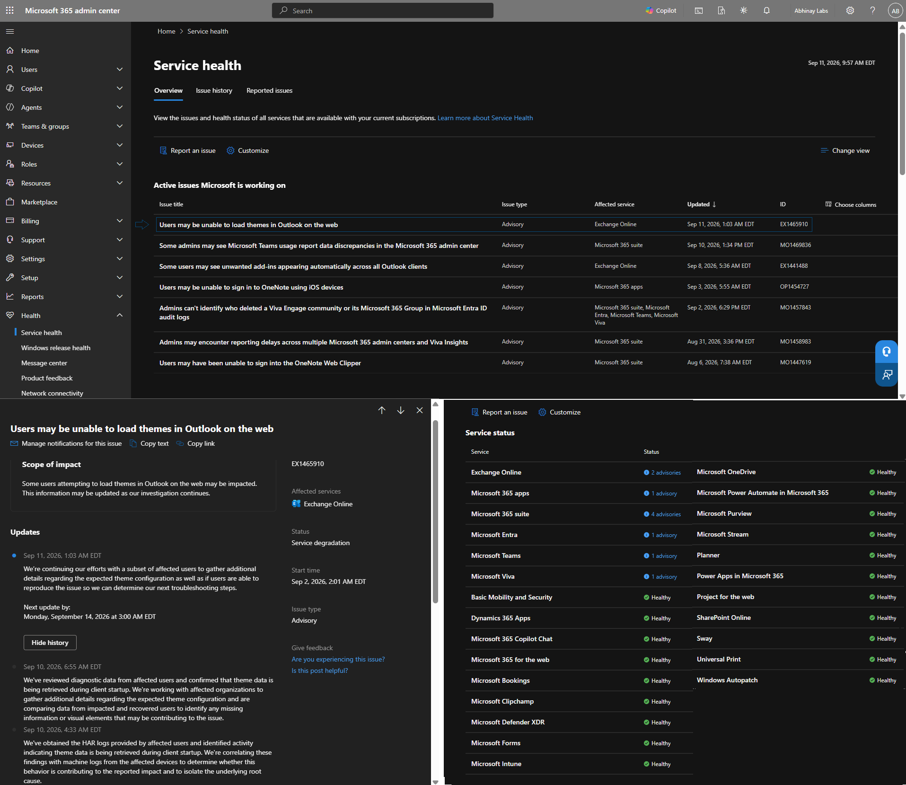
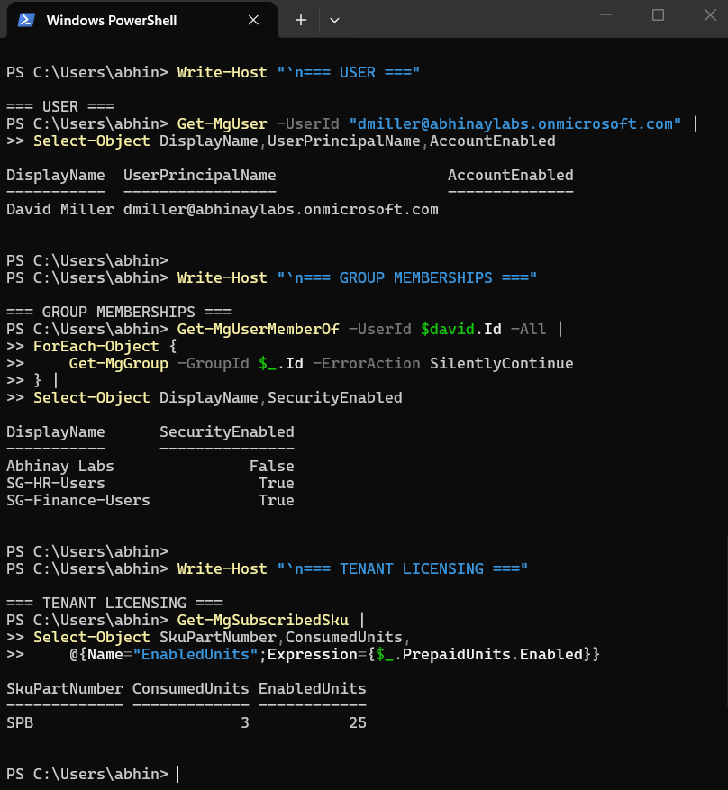
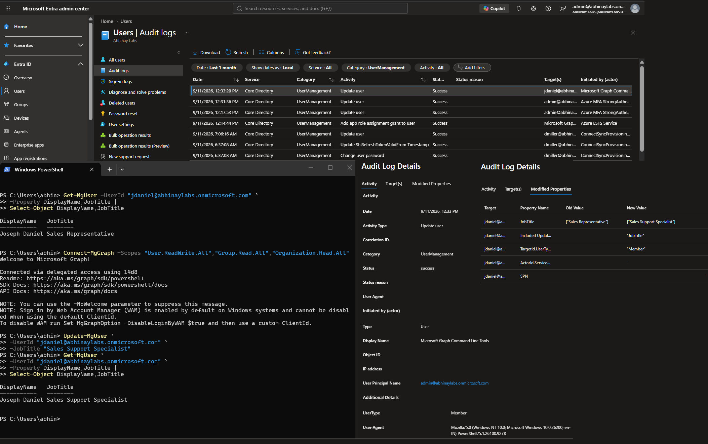
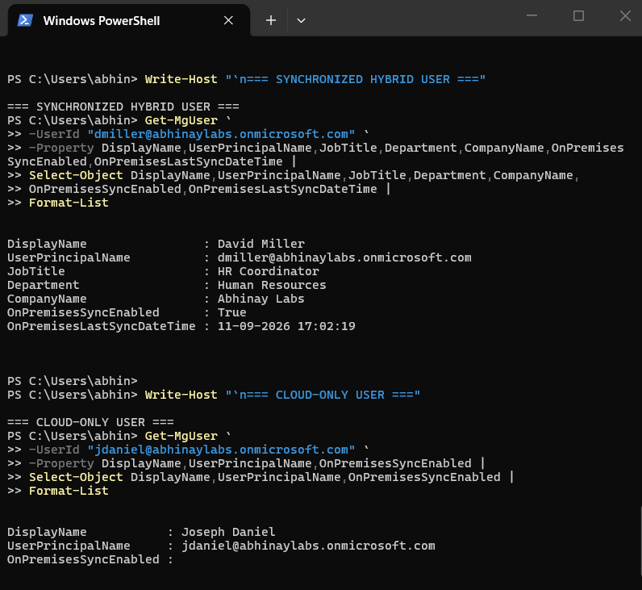
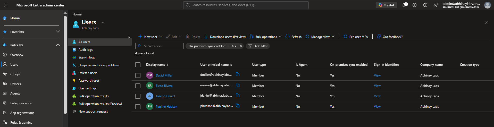

# Phase 9 — Monitoring, Microsoft Graph PowerShell & Hybrid Identity

## 1. Objective

The objective of this phase was to extend the Microsoft 365 lab beyond portal-based administration and introduce monitoring, repeatable PowerShell administration, and a controlled hybrid identity deployment.

The phase included:

- Microsoft Entra audit logs
- Microsoft 365 Service Health
- Microsoft Graph PowerShell
- Read-only Graph administration
- Controlled Graph user modification
- Audit verification of PowerShell activity
- Microsoft Entra Connect Sync
- Password Hash Synchronization
- Controlled synchronization scoping
- Existing cloud-user matching
- Hybrid identity source of authority
- Attribute synchronization
- Synchronization-service validation
- Duplicate identity troubleshooting
- Privileged cloud identity matching
- Restoring least-privilege administration after remediation
- Final controlled four-user hybrid rollout

This phase became one of the most technically significant parts of the project.

---

## 2. Why Monitoring Matters

Microsoft 365 administration is not limited to changing settings.

Administrators also need evidence showing:

- What changed
- Who performed the change
- Which application performed the change
- Whether the operation succeeded
- Whether Microsoft is experiencing a service incident
- Whether a problem is local to a user or tenant
- Whether synchronization is functioning correctly

Monitoring provides the evidence required to answer those questions.

---

## 3. Microsoft Entra Audit Logs

Microsoft Entra audit logs record many administrative and directory changes.

Useful audit information can include:

- Activity
- Date and time
- Target object
- Initiating user or application
- Result
- Modified properties
- Previous value
- New value

Conceptually:

```text
Administrative Change
        ↓
Microsoft Entra
        ↓
Audit Event
        ↓
Who / What / When / Result
```

Audit logs became especially useful when validating Microsoft Graph PowerShell activity and Microsoft Entra Connect synchronization.

---

## 4. Sign-In Logs vs Audit Logs

Sign-in logs and audit logs serve different purposes.

### Sign-In Logs

Primarily answer questions such as:

```text
Who attempted to authenticate?
Which application?
Did authentication succeed?
Why did it fail?
Which access policies were evaluated?
```

### Audit Logs

Primarily answer questions such as:

```text
What administrative change occurred?
Who or what performed it?
Which object changed?
What properties changed?
Did the operation succeed?
```

A useful distinction is:

```text
Sign-In Log
    ↓
Authentication activity

Audit Log
    ↓
Administrative / directory activity
```

Both are valuable during enterprise troubleshooting.

---

## 5. Microsoft 365 Service Health

Microsoft 365 Service Health was reviewed to determine whether reported problems could be caused by Microsoft-side incidents or advisories.

This is important because a user problem may originate from:

```text
User configuration
Client configuration
Identity
Authentication
Authorization
Licensing
Tenant configuration
Microsoft service incident
```

A technician should avoid repeatedly changing a user's configuration when Microsoft is already reporting a service problem.

---

## 6. Service Health Troubleshooting Principle

A useful troubleshooting decision is:

```text
One user affected?
        ↓
Investigate user / device / configuration

Multiple users affected?
        ↓
Check tenant configuration
        +
Check Microsoft 365 Service Health
```

This does not mean Service Health should be checked for every minor ticket.

It means Microsoft-side service availability should be considered when the scope and symptoms support it.

---

## 7. Microsoft Graph PowerShell

Microsoft Graph PowerShell provides PowerShell access to Microsoft Graph.

It allows administrators to perform repeatable Microsoft 365 and Microsoft Entra administration without relying entirely on graphical portals.

The lab used Graph PowerShell for:

- User queries
- Group-related investigation
- Licensing queries
- Controlled user-property modification
- Post-change validation
- Audit-log correlation

---

## 8. Why PowerShell Matters

Portal administration is useful for learning and interactive tasks.

PowerShell becomes increasingly valuable when administration needs to be:

- Repeatable
- Consistent
- Scalable
- Scriptable
- Easier to validate
- Easier to document

Conceptually:

```text
Portal
   ↓
Interactive administration

PowerShell
   ↓
Repeatable administration
```

The lab used both approaches rather than treating either one as a complete replacement for the other.

---

## 9. Microsoft Graph PowerShell Setup

The Microsoft Graph PowerShell authentication module was installed on the Windows host.

During setup, `Connect-MgGraph` did not initially load correctly in the PowerShell session.

The troubleshooting process included:

```text
Verify module installation
        ↓
Review PowerShell execution/session behavior
        ↓
Import required module
        ↓
Retry Microsoft Graph connection
        ↓
Authentication succeeds
```

This was a useful reminder that a PowerShell failure may involve the local module/session rather than Microsoft Entra itself.

The issue was resolved before continuing with Microsoft Graph administration.

---

## 10. Microsoft Graph Connection

For the controlled administrative task, Microsoft Graph was connected using required scopes including:

```text
User.ReadWrite.All
Group.Read.All
Organization.Read.All
```

The connection was limited to the permissions required for the work being performed.

This reinforced the principle that API and PowerShell permissions should also follow least privilege.

---

## 11. Read-Only User Query

Microsoft Graph PowerShell was used to retrieve user information.

Example:

```powershell
Get-MgUser -UserId "dmiller@abhinaylabs.onmicrosoft.com" -Property DisplayName,JobTitle |
Select-Object DisplayName,JobTitle
```

Another query was performed for Joseph Daniel:

```powershell
Get-MgUser -UserId "jdaniel@abhinaylabs.onmicrosoft.com" -Property DisplayName,JobTitle |
Select-Object DisplayName,JobTitle
```

These commands demonstrated how specific Microsoft Entra user properties can be retrieved through PowerShell.

---

## 12. Microsoft 365 Licensing Query

Microsoft Graph PowerShell was also used to inspect subscription licensing.

The command used was:

```powershell
Get-MgSubscribedSku |
Select-Object SkuPartNumber,ConsumedUnits,@{Name="EnabledUnits";Expression={$_.PrepaidUnits.Enabled}}
```

This allowed Microsoft 365 license information to be reviewed from PowerShell rather than only through the Microsoft 365 Admin Center.

---

## 13. Controlled Graph Administrative Change

Joseph Daniel was used for a controlled PowerShell administrative change.

His job title was initially:

```text
Sales Representative
```

Microsoft Graph PowerShell was used to update the cloud property to:

```text
Sales Support Specialist
```

The command was:

```powershell
Update-MgUser `
    -UserId "jdaniel@abhinaylabs.onmicrosoft.com" `
    -JobTitle "Sales Support Specialist"
```

The result was then verified:

```powershell
Get-MgUser `
    -UserId "jdaniel@abhinaylabs.onmicrosoft.com" `
    -Property DisplayName,JobTitle |
Select-Object DisplayName,JobTitle
```

This demonstrated a complete administrative workflow:

```text
Read current state
      ↓
Perform controlled change
      ↓
Read state again
      ↓
Verify result
```

---

## 14. Graph PowerShell Audit Validation

The Microsoft Entra audit logs were reviewed after the PowerShell update.

The audit event showed the Microsoft Graph command-line tooling as the initiating application and recorded the job-title modification.

This created a useful relationship:

```text
PowerShell command
      ↓
Microsoft Graph
      ↓
Microsoft Entra directory change
      ↓
Microsoft Entra audit event
```

This demonstrated that PowerShell administration still generates administrative evidence.

---

## 15. Auditability of Automation

PowerShell administration should not mean invisible administration.

A controlled Microsoft Graph change can still be:

- Authorized
- Logged
- Validated
- Reviewed

This is important because enterprise automation should remain accountable.

The project demonstrated:

```text
Change
  ↓
Validation
  ↓
Audit Evidence
```

rather than simply running commands without verifying their effect.

---

## 16. Hybrid Identity

The next part of the phase connected the existing on-premises Active Directory environment to Microsoft Entra ID.

The final architecture became:

```text
On-Premises Active Directory
abhinaylabs.internal
        |
        |
        v
Microsoft Entra Connect Sync
        |
        | Password Hash Synchronization
        |
        v
Microsoft Entra ID
abhinaylabs.onmicrosoft.com
        |
        v
Microsoft 365 Services
```

Unlike the earlier cloud-only portions of the project, this was an actual implemented hybrid identity configuration.

---

## 17. SYNC01

A separate Windows Server virtual machine named:

```text
SYNC01
```

was used for Microsoft Entra Connect Sync.

This kept the synchronization role separate from the existing domain controllers.

The relevant systems became:

```text
DC01
    Active Directory Domain Controller

DC02
    Additional Domain Controller

SYNC01
    Microsoft Entra Connect Sync

CLIENT01
    Traditional AD domain-joined endpoint

CLOUDCLIENT01
    Microsoft Entra joined endpoint
```

This created a clearer separation between directory services, synchronization, and endpoint roles.

---

## 18. Microsoft Entra Connect Sync

Microsoft Entra Connect Sync links supported on-premises Active Directory identities with Microsoft Entra ID.

The lab used a custom configuration rather than synchronizing the entire environment automatically.

The configuration was intentionally controlled because the goal was to understand the synchronization process without unnecessarily changing every object in the Active Directory environment.

---

## 19. Identity Matching Configuration

During configuration, the environment used the option indicating that users were represented only once across directories.

The source-anchor configuration was allowed to be managed by the Microsoft Entra Connect configuration.

The resulting source-anchor approach used:

```text
mS-DS-ConsistencyGuid
```

for the synchronized identities.

The source anchor helps Microsoft Entra Connect consistently associate an on-premises identity with its corresponding cloud identity.

---

## 20. Password Hash Synchronization

The hybrid deployment used:

```text
Password Hash Synchronization
```

Password Hash Synchronization allows users to authenticate to Microsoft Entra using a password derived from their on-premises Active Directory credential.

The architecture can be summarized as:

```text
On-Premises Password
        ↓
Active Directory password hash
        ↓
Additional one-way derived hash used for synchronization
        ↓
Microsoft Entra ID
        ↓
Cloud authentication
```

Plaintext passwords are not synchronized to Microsoft Entra.

The synchronization mechanism does not provide Microsoft Entra with a reversible copy of the user's plaintext password.

---

## 21. Controlled Synchronization Scope

The project intentionally avoided synchronizing the entire Active Directory environment.

A controlled pilot group was created:

```text
Entra-Sync-Pilot
```

The group was located in the on-premises Active Directory environment.

The synchronization scope was limited to selected employee identities.

The final pilot users were:

```text
David Miller
Elena Rivera
Joseph Daniel
Pauline Hudson
```

This provided a controlled rollout instead of an unnecessary whole-directory synchronization.

---

## 22. What Was Not Synchronized

The project intentionally did **not** synchronize:

- The entire Active Directory directory
- On-premises Active Directory groups
- CLIENT01
- Other on-premises computer objects
- Every available organizational object

The Microsoft Entra departmental security groups remained cloud-managed.

Therefore:

```text
On-Premises Users
Selected four users synchronized

On-Premises Groups
Not synchronized

CLIENT01
Not synchronized

Entire directory
Not synchronized
```

This synchronization boundary is important when explaining the project.

---

## 23. David Miller — Initial Hybrid Pilot

David Miller was used as the initial controlled synchronization test.

His on-premises UPN was aligned with the cloud identity:

```text
dmiller@abhinaylabs.onmicrosoft.com
```

The objective was to match the existing on-premises David Miller identity to the existing cloud David Miller identity rather than create an unnecessary second employee account.

The expected result was:

```text
On-Premises David Miller
        ↓
Microsoft Entra Connect
        ↓
Existing Cloud David Miller
```

---

## 24. Existing Cloud Identity Preservation

The initial pilot successfully demonstrated that the existing cloud identity could be preserved while becoming synchronized.

The resulting Microsoft Entra user showed:

```text
On-premises sync enabled:
Yes
```

This represented the transition from:

```text
Cloud-created identity
        ↓
Matched hybrid identity
```

without replacing the employee with an unrelated duplicate account.

---

## 25. Source of Authority

Hybrid identity introduced one of the most important concepts in the project:

```text
Source of Authority
```

A source of authority is the system from which an attribute should be administered.

For cloud-only users:

```text
Microsoft Entra ID
        ↓
Cloud-managed attributes
```

For synchronized attributes:

```text
On-Premises Active Directory
        ↓
Microsoft Entra Connect
        ↓
Microsoft Entra ID
```

Therefore, after synchronization:

> An administrator must determine the source of authority before modifying an attribute.

---

## 26. Hybrid Users Are Not Entirely On-Premises Managed

A synchronized identity does not mean that every possible property must be administered in on-premises Active Directory.

A hybrid user can contain a combination of:

```text
On-premises-mastered attributes
        +
Cloud-managed properties
```

For example:

```text
Job title / department
    ↓
May be sourced from on-premises AD

Microsoft Entra administrative role
    ↓
Cloud-managed
```

This distinction became important during later troubleshooting.

---

## 27. Joseph Daniel — Source-of-Authority Demonstration

Earlier in Phase 9, Microsoft Graph PowerShell changed Joseph Daniel's cloud job title from:

```text
Sales Representative
```

to:

```text
Sales Support Specialist
```

That change was valid while the relevant attribute was cloud-managed.

After Joseph became synchronized, the authoritative on-premises Active Directory value was:

```text
Sales Representative
```

The hybrid synchronization process therefore reinforced that the synchronized attribute should be managed from its authoritative source.

This demonstrated the difference between:

```text
Cloud-only administration
        vs
Hybrid source-of-authority administration
```

---

## 28. Attribute Synchronization Issue

After the controlled hybrid rollout, several cloud profile values disappeared for some synchronized users.

The affected attributes included values such as:

- Company
- Department
- Job title

The reason was not that Microsoft Entra randomly deleted valid information.

The on-premises Active Directory values were blank.

Once Active Directory became authoritative for those synchronized attributes, the blank source values were synchronized.

The troubleshooting logic was:

```text
Cloud value previously populated
        ↓
User becomes synchronized
        ↓
On-premises attribute is authoritative
        ↓
On-premises value blank
        ↓
Cloud synchronized value becomes blank
```

---

## 29. Attribute Remediation

The appropriate values were populated in on-premises Active Directory.

The authoritative values included:

```text
David Miller
Job Title: HR Coordinator
Department: Human Resources
Company: Abhinay Labs

Elena Rivera
Job Title: Financial Analyst
Department: Finance
Company: Abhinay Labs

Joseph Daniel
Job Title: Sales Representative
Department: Sales
Company: Abhinay Labs

Pauline Hudson
Job Title: IT Support Specialist
Department: IT
Company: Abhinay Labs
```

A synchronization cycle was then performed.

The values appeared correctly in Microsoft Entra after synchronization.

The correct solution was therefore:

```text
Fix authoritative source
        ↓
Synchronize
        ↓
Validate cloud result
```

rather than repeatedly editing the synchronized cloud property.

---

## 30. Synchronization Service Manager

Microsoft Entra Connect synchronization activity was reviewed through Synchronization Service Manager.

Successful synchronization stages included:

```text
Import
Sync
Export
```

The successful run history provided evidence that the synchronization engine was processing the configured identity changes.

---

## 31. Connector Space Validation

The Microsoft Entra Connect connector-space information was inspected for the pilot identity.

David Miller's on-premises distinguished name reflected the HR organizational structure.

The connector information demonstrated that Microsoft Entra Connect could identify the on-premises object and process it through the configured synchronization rules.

Preview functionality was used as a diagnostic tool.

Preview data was treated as troubleshooting information rather than something that had to be committed simply because it could be generated.

---

## 32. Synchronization Scheduler Validation

After initial configuration, the Microsoft Entra Connect synchronization scheduler required validation.

The synchronization service itself was running, but the scheduler was initially observed with:

```text
SyncCycleEnabled : False
```

This showed why configuration completion should not be treated as proof that recurring synchronization is operational.

The scheduler was corrected and then revalidated.

The final expected operational state was:

```text
SyncCycleEnabled                  : True
StagingModeEnabled                : False
SchedulerSuspended                : False
SyncCycleInProgress               : False
CurrentlyEffectiveSyncCycleInterval : 00:30:00
```

---

## 33. Microsoft Entra Connect Service Validation

The Microsoft Entra Connect service was also checked.

The validation command was:

```powershell
Get-Service ADSync |
Select-Object Name,Status,StartType
```

The desired operational state was:

```text
Name      : ADSync
Status    : Running
StartType : Automatic
```

This established that both the Windows service and synchronization scheduler were functioning.

---

## 34. Synchronization Commands Used

### Review Synchronization Scheduler

```powershell
Get-ADSyncScheduler |
Select-Object SyncCycleEnabled,
              StagingModeEnabled,
              SchedulerSuspended,
              SyncCycleInProgress,
              CurrentlyEffectiveSyncCycleInterval
```

### Review Microsoft Entra Connect Service

```powershell
Get-Service ADSync |
Select-Object Name,Status,StartType
```

### Start a Delta Synchronization Cycle

```powershell
Start-ADSyncSyncCycle -PolicyType Delta
```

A delta synchronization was used after controlled identity and attribute changes to process the new changes.

---

## 35. Expanded Four-User Rollout

After the initial pilot validation, synchronization scope was expanded to the four intended employee identities:

```text
David Miller
Elena Rivera
Joseph Daniel
Pauline Hudson
```

David, Elena, and Joseph matched their intended cloud identities.

Pauline produced a more complex identity-matching problem.

This became one of the strongest troubleshooting scenarios in the entire project.

---

## 36. Pauline Hudson — Duplicate Identity Problem

Before the hybrid rollout, the original cloud identity was:

```text
phudson@abhinaylabs.onmicrosoft.com
```

That identity already held the Microsoft Entra:

```text
Helpdesk Administrator
```

role.

During synchronization, Microsoft Entra Connect did not automatically take over that privileged cloud identity.

Instead, an unintended synchronized duplicate appeared:

```text
phudson1975@abhinaylabs.onmicrosoft.com
```

The environment temporarily contained:

```text
Original cloud Pauline
phudson@abhinaylabs.onmicrosoft.com

        +

Unintended synchronized Pauline
phudson1975@abhinaylabs.onmicrosoft.com
```

This was not the desired final identity model.

---

## 37. Existing Administrative Role Conflict

Investigation showed that the original Pauline cloud identity already held a privileged Microsoft Entra administrative role.

This introduced protection against automatically matching the incoming on-premises identity to the privileged cloud identity.

The important security lesson was:

> Privileged cloud identities receive additional protection during identity matching.

The correct objective was still to preserve one employee identity.

The administrative role conflict did not mean Pauline should permanently have separate cloud and synchronized identities.

---

## 38. Why the Duplicate Was Not Kept

Keeping both identities would have produced an incorrect identity lifecycle:

```text
One employee
        ↓
Two active identities
```

That would complicate:

- Authentication
- Licensing
- Group membership
- Microsoft 365 access
- Audit history
- Administrative roles
- Offboarding
- Support troubleshooting

The desired model was:

```text
Pauline Hudson
        ↓
One identity
        ↓
Hybrid synchronized
        +
Required cloud administrative role
```

---

## 39. Pauline Remediation Workflow

The duplicate-identity problem was remediated carefully.

The workflow was:

```text
1. Verify the legitimate original Pauline identity
        ↓
2. Verify existing Helpdesk Administrator role
        ↓
3. Temporarily remove Helpdesk Administrator
        ↓
4. Temporarily remove Pauline from pilot sync scope
        ↓
5. Run synchronization
        ↓
6. Unintended phudson1975 object moves out of active users
        ↓
7. Permanently remove only the unintended duplicate
        ↓
8. Confirm original phudson identity remains
        ↓
9. Re-add on-premises Pauline to pilot scope
        ↓
10. Run synchronization
        ↓
11. Existing phudson cloud identity matches successfully
        ↓
12. Verify only one Pauline remains
        ↓
13. Restore Helpdesk Administrator
        ↓
14. Validate synchronized identity and least-privilege role
```

The process avoided blindly deleting the legitimate cloud identity.

---

## 40. Why Verification Before Deletion Mattered

When duplicate identities appear, an administrator should not simply delete whichever object looks unusual.

Before deletion, the technician should determine:

- Which identity is legitimate
- Which identity contains the expected user history
- Which object is cloud-only
- Which object is synchronized
- Which object contains licensing
- Which object has administrative roles
- Which object was created unintentionally
- What caused the matching failure

The Pauline scenario demonstrated:

```text
Investigate first
        ↓
Identify intended identity
        ↓
Correct matching condition
        ↓
Remove only unintended object
```

---

## 41. Restoring Least Privilege

After Pauline's original identity successfully became synchronized, the Microsoft Entra:

```text
Helpdesk Administrator
```

role was restored to that same identity.

The final identity model was:

```text
Pauline Hudson
phudson@abhinaylabs.onmicrosoft.com
        |
        +-- On-premises sync enabled: Yes
        |
        +-- Helpdesk Administrator
```

The role remained cloud-managed even though selected identity attributes were synchronized from Active Directory.

This demonstrated that:

```text
Synchronized user
        ≠
Every property controlled on-premises
```

---

## 42. On-Premises Access vs Cloud Administrative Role

On-premises Active Directory permissions and Microsoft Entra administrative roles are separate authorization systems.

Giving Pauline similar support responsibilities in the on-premises environment would not remove the Microsoft Entra privileged-identity matching protection.

Conceptually:

```text
On-Premises AD Permission
        ≠
Microsoft Entra Administrative Role
```

Administrators must evaluate each platform independently.

---

## 43. Final Hybrid Identity State

The final controlled rollout contained four synchronized employee identities:

```text
David Miller
Elena Rivera
Joseph Daniel
Pauline Hudson
```

Microsoft Entra showed:

```text
On-premises sync enabled:
Yes
```

for the four intended users.

The final state contained:

```text
One David
One Elena
One Joseph
One Pauline
```

with no unintended `phudson1975` active identity remaining.

---

## 44. Hybrid Synchronization Boundary

The final architecture intentionally remained limited.

```text
ON-PREMISES AD DS
        |
        +-- David Miller --------+
        +-- Elena Rivera --------|
        +-- Joseph Daniel -------|--> Microsoft Entra Connect
        +-- Pauline Hudson ------+        |
                                          |
                                          v
                                 Microsoft Entra ID
```

The following remained outside the synchronization scope:

```text
On-premises security groups
CLIENT01
Other computer objects
Entire AD directory
```

This prevented the project from overstating its hybrid implementation.

---

## 45. CLIENT01 Remained Traditional AD Joined

`CLIENT01` remained:

```text
Active Directory domain joined
```

It was not converted to:

```text
Hybrid Microsoft Entra joined
```

during this project.

This was intentional.

Device hybrid join was not required to demonstrate hybrid **user identity synchronization**.

Therefore, the project should not claim that CLIENT01 was Hybrid Microsoft Entra joined.

---

## 46. CLOUDCLIENT01 Remained Cloud-First

`CLOUDCLIENT01` remained the separate:

```text
Microsoft Entra joined
```

endpoint from Phase 8.

This created three distinct concepts in the broader lab:

```text
CLIENT01
Traditional AD domain joined

CLOUDCLIENT01
Microsoft Entra joined

Four employee identities
Hybrid synchronized through Entra Connect
```

This separation made the identity models easier to explain.

---

## 47. Microsoft Entra Audit Evidence for Synchronization

Microsoft Entra audit logs recorded directory synchronization activity.

The logs showed synchronization-related user updates and the application/service responsible for those changes.

This provided cloud-side evidence that Microsoft Entra Connect was modifying the intended directory objects.

The monitoring relationship became:

```text
On-Premises AD Change
        ↓
Microsoft Entra Connect
        ↓
Microsoft Entra Update
        ↓
Audit Evidence
```

---

## 48. Hybrid Identity Troubleshooting Model

A useful troubleshooting model for synchronized users is:

```text
Correct on-premises user?
        ↓
Correct UPN?
        ↓
User in intended sync scope?
        ↓
Microsoft Entra Connect service running?
        ↓
Scheduler enabled?
        ↓
Sync cycle successful?
        ↓
Object imported?
        ↓
Identity matched correctly?
        ↓
Correct source of authority?
        ↓
Cloud object updated?
        ↓
Required cloud-only access restored?
```

This prevents administrators from immediately editing the cloud object when the authoritative issue exists on-premises.

---

## 49. Duplicate Identity Troubleshooting Model

When a duplicate synchronized identity appears:

```text
Do not blindly delete
        ↓
Identify both objects
        ↓
Determine intended identity
        ↓
Check UPN / matching attributes
        ↓
Check privileged role conflicts
        ↓
Check synchronization scope
        ↓
Correct matching condition
        ↓
Remove only unintended object
        ↓
Synchronize again
        ↓
Validate one intended identity
```

This workflow came directly from the Pauline troubleshooting scenario.

---

## 50. Monitoring + Automation + Hybrid Identity

Phase 9 connected three previously separate administration areas.

```text
MONITORING
Audit Logs
Service Health
        |
        |
        v
ADMINISTRATION
Microsoft Graph PowerShell
        |
        |
        v
HYBRID IDENTITY
Microsoft Entra Connect Sync
```

Together they demonstrated that enterprise administration involves:

```text
Make change
      ↓
Observe result
      ↓
Review evidence
      ↓
Troubleshoot unexpected behavior
      ↓
Validate final state
```

---

## 51. Enterprise Relevance

Hybrid Microsoft environments are common because organizations may maintain traditional Active Directory while also using Microsoft 365 and Microsoft Entra ID.

Common enterprise tasks include:

- Synchronizing employee identities
- Troubleshooting synchronization
- Investigating duplicate identities
- Managing source-of-authority issues
- Validating directory updates
- Reviewing audit logs
- Checking Microsoft Service Health
- Performing repeatable PowerShell administration
- Maintaining cloud administrative roles
- Supporting cloud authentication

This phase provided hands-on exposure to those workflows.

---

## 52. IT Support Relevance

A Service Desk or Microsoft 365 support technician may encounter tickets such as:

```text
"User's department is wrong in Microsoft 365."

"Password changed in AD but cloud sign-in is failing."

"Two cloud accounts exist for the same employee."

"User's Microsoft 365 profile did not update."

"Is Microsoft having an outage?"

"Who changed this user property?"

"Is directory synchronization running?"
```

A useful support mindset is:

```text
Determine scope
      ↓
Determine source of authority
      ↓
Check synchronization / logs
      ↓
Perform authorized remediation
      ↓
Validate both on-premises and cloud state
```

---

## 53. IAM and Security Relevance

This phase demonstrated several core IAM principles.

### Single Identity

One employee should normally have one intended organizational identity rather than unnecessary duplicate identities.

### Source of Authority

Administrators must know which system controls an attribute.

### Least Privilege

Administrative roles should be restored only where legitimately required.

### Controlled Rollout

Pilot synchronization reduces risk compared with synchronizing every object immediately.

### Auditability

Administrative and synchronization changes should leave evidence.

### Identity Matching Protection

Privileged cloud identities require careful handling during hybrid matching.

---

## 54. Security Considerations

Hybrid identity connects two identity systems.

Errors can therefore have broader impact.

Important practices include:

- Pilot synchronization before broad rollout
- Verify UPNs
- Understand identity matching
- Protect privileged cloud identities
- Avoid blindly deleting duplicate objects
- Validate source of authority
- Monitor synchronization health
- Review audit evidence
- Use least privilege
- Keep synchronization scope intentional
- Validate changes from both on-premises and cloud perspectives

The lab intentionally avoided unnecessary group, device, and whole-directory synchronization.

---

## 55. Evidence

### Figure 18 — Hybrid Identity Synchronization Verification

Microsoft Entra synchronization evidence demonstrates the transition from cloud-only identities to controlled hybrid synchronization.



### Figure 19 — Microsoft Entra Audit Log Hybrid Update

Microsoft Entra audit activity shows synchronization-driven changes to hybrid user objects.



### Figure 20 — Microsoft 365 Service Health Investigation

Microsoft 365 Service Health was reviewed to distinguish local user problems from Microsoft-side service incidents and advisories.



### Figure 21 — Microsoft Graph PowerShell Queries

Microsoft Graph PowerShell was used to retrieve Microsoft Entra user, group, and licensing information.



### Figure 22 — Graph PowerShell Update and Audit Verification

A controlled Microsoft Graph PowerShell user-property change was validated through both a follow-up query and Microsoft Entra audit evidence.



### Figure 23 — Hybrid vs Cloud Source of Authority

The lab compared synchronized and cloud-managed identity states to demonstrate how source of authority changes administration.



### Figure 24 — Controlled Four-User Hybrid Rollout

The final Microsoft Entra view confirms that David Miller, Elena Rivera, Joseph Daniel, and Pauline Hudson were the four intended synchronized employee identities.



---

## 56. Key Commands Used

### Query a Microsoft Entra User

```powershell
Get-MgUser -UserId "dmiller@abhinaylabs.onmicrosoft.com" -Property DisplayName,JobTitle |
Select-Object DisplayName,JobTitle
```

### Query Joseph Daniel

```powershell
Get-MgUser -UserId "jdaniel@abhinaylabs.onmicrosoft.com" -Property DisplayName,JobTitle |
Select-Object DisplayName,JobTitle
```

### Update Joseph's Job Title

```powershell
Update-MgUser `
    -UserId "jdaniel@abhinaylabs.onmicrosoft.com" `
    -JobTitle "Sales Support Specialist"
```

### Review Microsoft 365 Subscription Licensing

```powershell
Get-MgSubscribedSku |
Select-Object SkuPartNumber,ConsumedUnits,@{Name="EnabledUnits";Expression={$_.PrepaidUnits.Enabled}}
```

### Review Microsoft Entra Connect Scheduler

```powershell
Get-ADSyncScheduler |
Select-Object SyncCycleEnabled,
              StagingModeEnabled,
              SchedulerSuspended,
              SyncCycleInProgress,
              CurrentlyEffectiveSyncCycleInterval
```

### Review Microsoft Entra Connect Service

```powershell
Get-Service ADSync |
Select-Object Name,Status,StartType
```

### Trigger Delta Synchronization

```powershell
Start-ADSyncSyncCycle -PolicyType Delta
```

---

## 57. Interview Explanation

A concise interview explanation for this phase is:

> In my Microsoft 365 and Entra lab, I used audit logs and Microsoft 365 Service Health to investigate administrative activity and distinguish local issues from Microsoft-side service problems. I also installed and used Microsoft Graph PowerShell to query users and licensing and performed a controlled user-property update, which I then verified through Microsoft Entra audit logs. I extended my existing on-premises Active Directory lab into a hybrid identity environment by deploying Microsoft Entra Connect Sync on a separate Windows Server, enabling Password Hash Synchronization, and limiting synchronization to a four-user pilot group. I matched the existing cloud identities rather than creating replacement accounts and learned how source of authority changes after synchronization. During the rollout, Pauline Hudson produced a duplicate synchronized identity because her original cloud account held the privileged Helpdesk Administrator role. I investigated the objects, temporarily removed the conflicting role and the user from pilot scope, removed only the unintended duplicate, synchronized the original identity successfully, and then restored the Helpdesk Administrator role. I finished by validating one synchronized identity for each of the four employees and confirming the Entra Connect service and scheduler were healthy.

---

## 58. Key Lessons Learned

1. Microsoft Entra audit logs provide evidence of administrative and synchronization changes.
2. Sign-in logs and audit logs answer different troubleshooting questions.
3. Microsoft 365 Service Health helps distinguish local issues from Microsoft-side service incidents.
4. Microsoft Graph PowerShell provides repeatable Microsoft 365 and Entra administration.
5. PowerShell changes should be validated after execution rather than assumed successful.
6. Microsoft Graph administrative changes can be correlated with Microsoft Entra audit events.
7. Microsoft Entra Connect Sync can link existing on-premises identities to existing Microsoft Entra identities.
8. Password Hash Synchronization does not synchronize plaintext passwords.
9. A controlled pilot synchronization is safer and easier to troubleshoot than synchronizing the entire directory immediately.
10. UPN alignment and identity matching are important when preserving existing cloud accounts.
11. Source of authority must be identified before modifying synchronized attributes.
12. Blank authoritative on-premises attributes can overwrite previously populated synchronized cloud values.
13. The correct fix for synchronized attribute problems is normally to correct the authoritative source and synchronize again.
14. Synchronization Service Manager can provide useful import, sync, and export evidence.
15. Microsoft Entra Connect configuration should be followed by scheduler and service validation.
16. One employee should normally have one intended identity rather than unnecessary duplicate active identities.
17. Duplicate synchronized identities should be investigated before any object is deleted.
18. Privileged Microsoft Entra roles can affect identity-matching behavior and require careful remediation.
19. On-premises permissions and Microsoft Entra administrative roles are separate authorization systems.
20. A synchronized user may contain both on-premises-mastered attributes and cloud-managed properties.
21. The final project synchronized only four controlled users; it did not synchronize on-premises groups, CLIENT01, or the complete Active Directory environment.
22. CLIENT01 remained traditionally AD domain joined, while CLOUDCLIENT01 remained separately Microsoft Entra joined.
23. Hybrid identity troubleshooting requires validation on both the on-premises and cloud sides.
24. Monitoring, automation, and identity administration should work together rather than as isolated tasks.

---

## 59. Phase Result

Phase 9 successfully expanded the Microsoft 365 lab into a monitored, PowerShell-enabled, controlled hybrid identity environment.

The phase demonstrated:

- Microsoft Entra audit-log investigation
- Microsoft 365 Service Health investigation
- Microsoft Graph PowerShell setup
- User queries
- Licensing queries
- Controlled Graph administration
- PowerShell audit verification
- Microsoft Entra Connect Sync deployment
- Password Hash Synchronization
- `mS-DS-ConsistencyGuid` source-anchor configuration
- Controlled pilot synchronization
- Existing cloud-user matching
- Hybrid identity source of authority
- Attribute synchronization troubleshooting
- Synchronization Service Manager validation
- Scheduler validation
- ADSync service validation
- Delta synchronization
- Controlled four-user rollout
- Duplicate identity investigation
- Privileged identity matching troubleshooting
- Pauline Hudson duplicate remediation
- Restoration of Helpdesk Administrator
- Final hybrid user validation
- Clear synchronization-scope boundaries

The final result was a controlled hybrid identity environment in which the four intended synthetic employees were synchronized from the existing Active Directory environment into Microsoft Entra ID while preserving their intended cloud identities and cloud-specific access.

**Phase 9 Status: COMPLETE**
