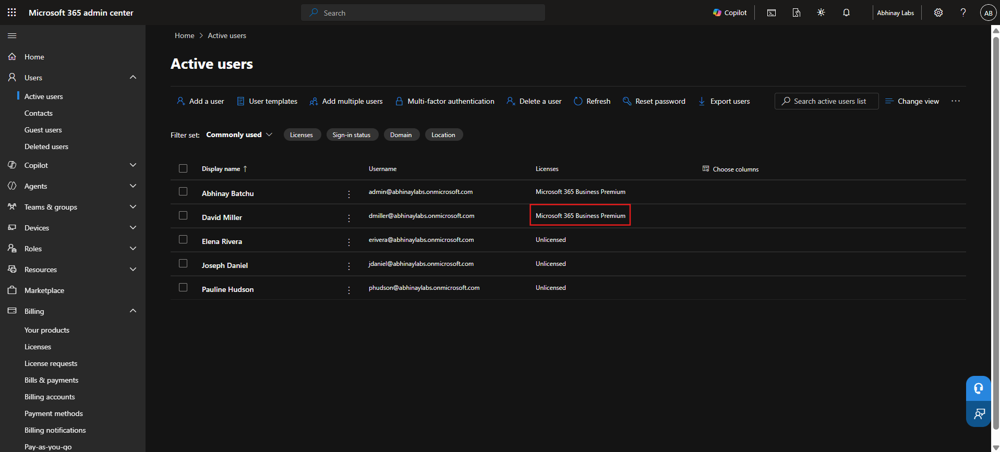
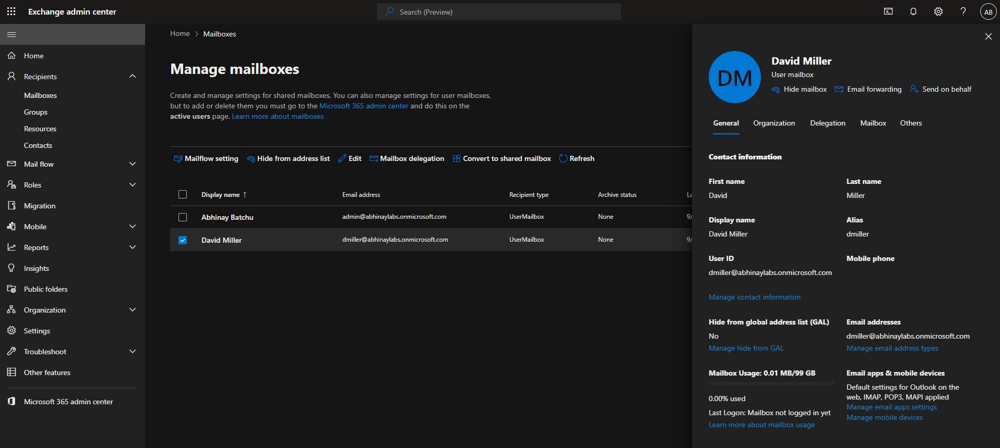
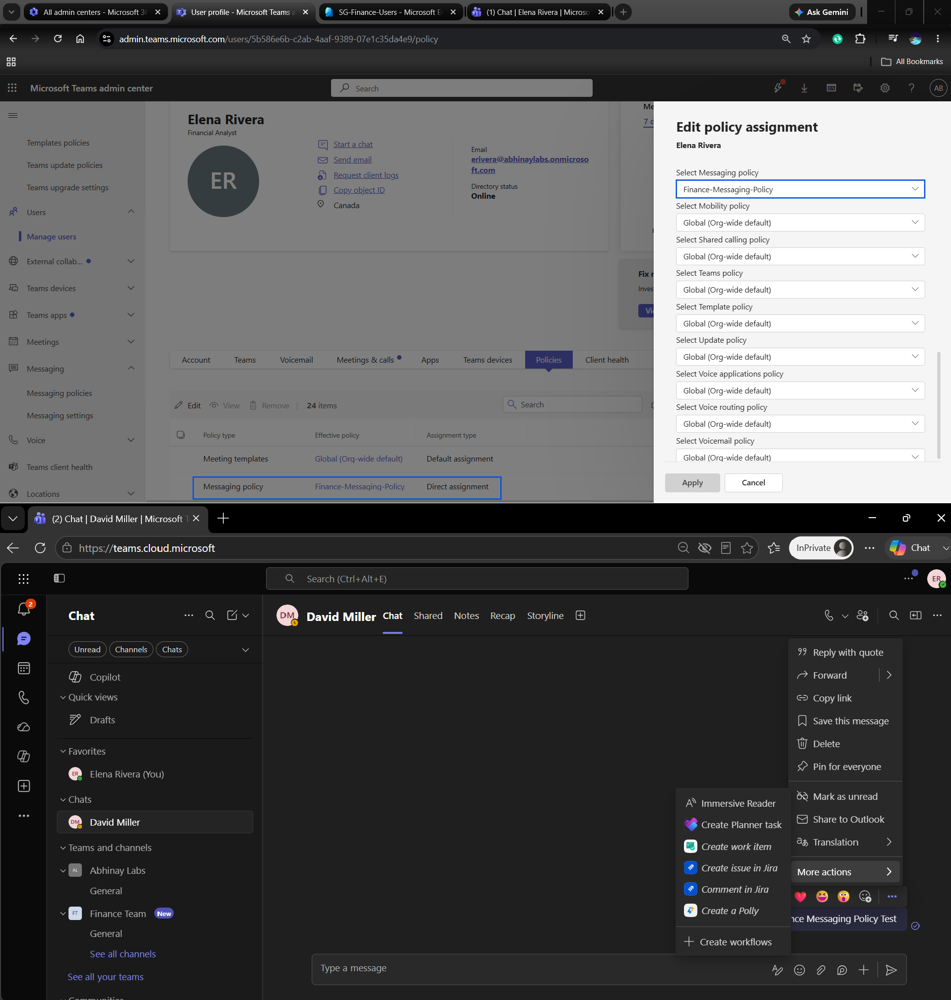
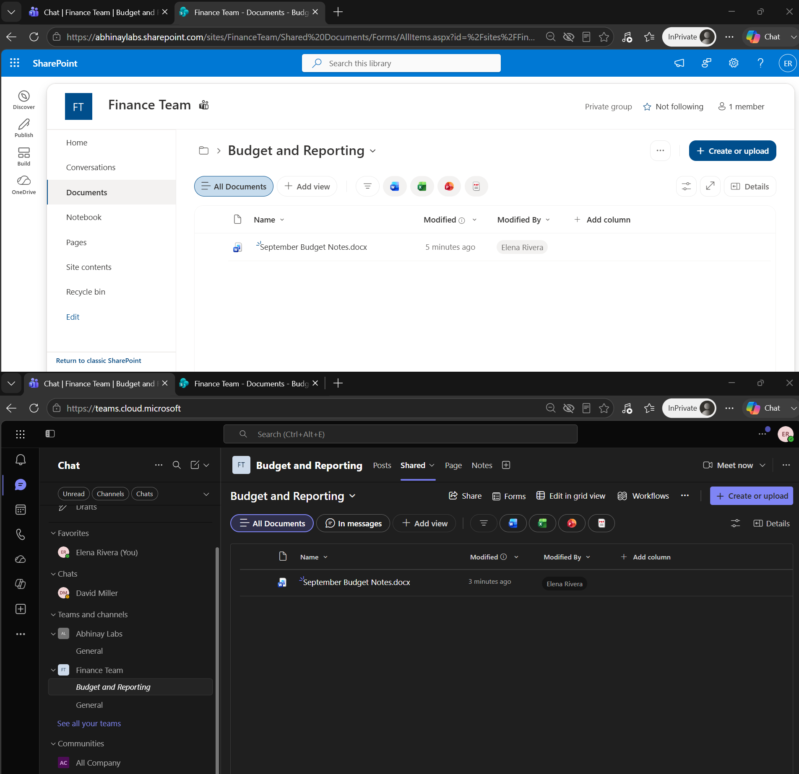
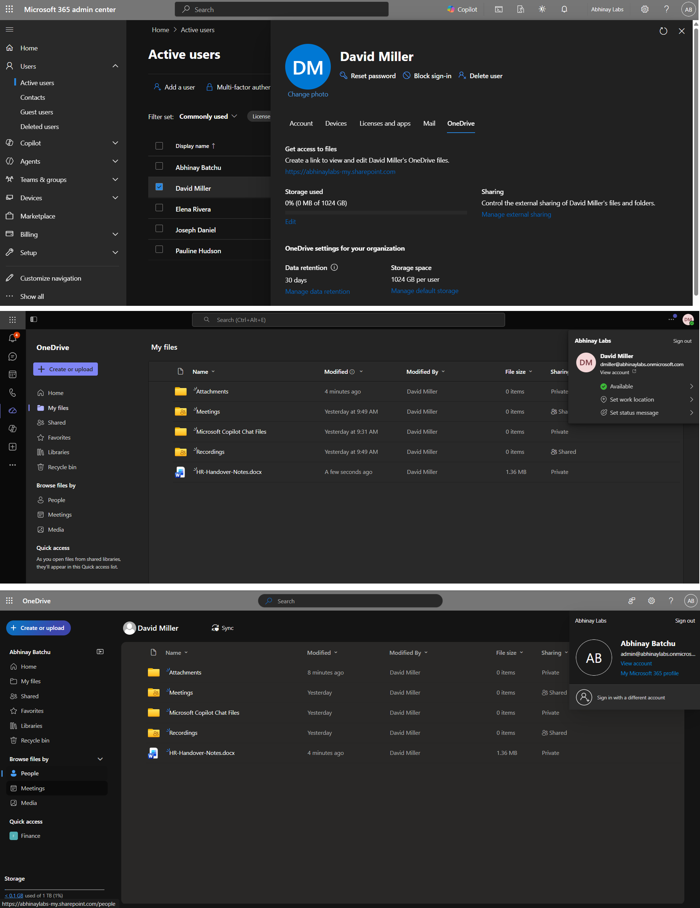
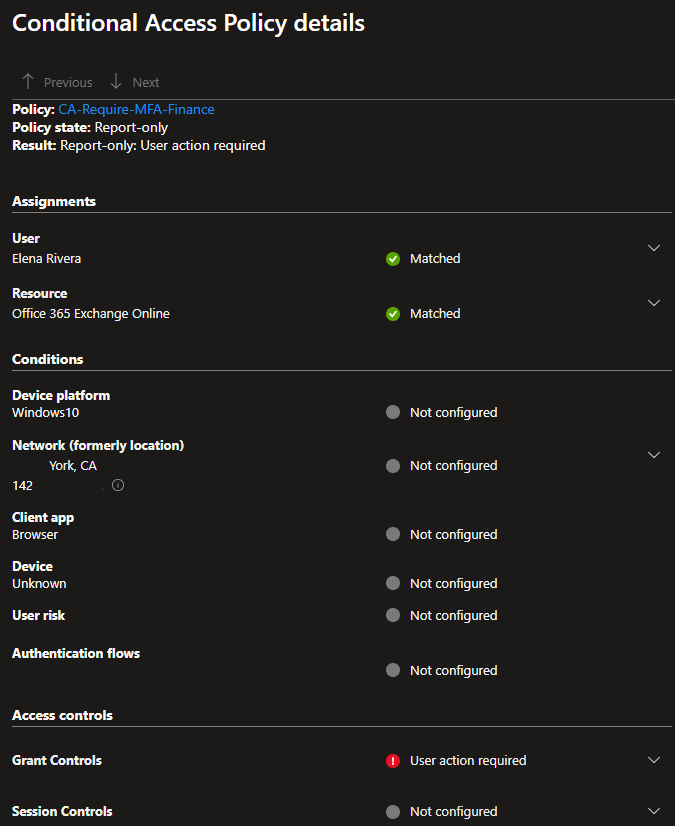
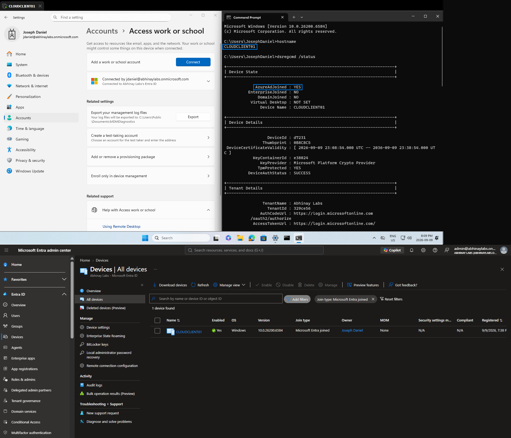

# Microsoft 365, Entra ID & Hybrid Identity IT Support Lab

## Overview

This project simulates Microsoft 365 and identity administration for a fictional organization named **Abhinay Labs**.

The lab was designed to build practical skills for entry-level **IT Support, Service Desk, Microsoft 365 Support, IAM, and IT Security Support** roles.

The project began with cloud-native Microsoft 365 and Microsoft Entra ID administration and later expanded into Microsoft 365 workload administration, authentication troubleshooting, least-privilege RBAC, Conditional Access, Microsoft Entra device identity, Microsoft Graph PowerShell, and controlled hybrid identity synchronization with an existing on-premises Active Directory environment.

All employee identities, company information, systems, and business data used in this project are synthetic and were created solely for the lab.

---

## Project Objectives

The project was designed to develop hands-on experience with:

- Microsoft 365 tenant administration
- Microsoft Entra ID user and group administration
- Microsoft 365 licensing and service provisioning
- Password and authentication support
- Sign-in and audit log investigation
- Microsoft Exchange Online administration
- Microsoft Teams administration
- SharePoint and OneDrive support
- Group-based access control
- Microsoft Entra administrative roles
- Least-privilege Help Desk administration
- Conditional Access evaluation
- Microsoft Entra device identity
- Microsoft Graph PowerShell
- Microsoft 365 Service Health investigation
- Microsoft Entra Connect Sync
- Password Hash Synchronization
- Hybrid identity source-of-authority concepts
- Identity synchronization troubleshooting
- Joiner, Mover, and Leaver support workflows
- Enterprise Help Desk troubleshooting methodology

---

## Lab Architecture

The project combines an existing on-premises Active Directory environment with a Microsoft 365 / Microsoft Entra cloud tenant.

```text
                          ABHINAY LABS
                 HYBRID IDENTITY LAB ENVIRONMENT


 ON-PREMISES ENVIRONMENT                          MICROSOFT CLOUD
 abhinaylabs.internal                             abhinaylabs.onmicrosoft.com

 ┌───────────────────────────┐                    ┌──────────────────────────────┐
 │        DC01 / DC02        │                    │     Microsoft Entra ID       │
 │                           │                    │                              │
 │ Active Directory DS       │                    │ Users                        │
 │ DNS                       │                    │ Cloud Security Groups        │
 │ Users / OUs / Groups      │                    │ Administrative Roles         │
 │ Domain Authentication     │                    │ Authentication / MFA         │
 └─────────────┬─────────────┘                    │ Conditional Access           │
               │                                  │ Sign-In Logs                 │
               │                                  │ Audit Logs                   │
               │                                  │ Device Identities            │
               │                                  └──────────────┬───────────────┘
               │                                                 │
               │                                                 │
     ┌─────────▼──────────┐                         ┌────────────▼─────────────┐
     │  Entra-Sync-Pilot  │                         │ Microsoft 365 Services   │
     │                    │                         │                          │
     │ David Miller       │                         │ Exchange Online          │
     │ Elena Rivera       │                         │ Microsoft Teams          │
     │ Joseph Daniel      │                         │ SharePoint Online        │
     │ Pauline Hudson     │                         │ OneDrive                 │
     └─────────┬──────────┘                         └──────────────────────────┘
               │
               │ Controlled user synchronization
               â–¼
     ┌────────────────────┐
     │       SYNC01       │
     │                    │
     │ Microsoft Entra    │
     │ Connect Sync       │
     │                    │
     │ Password Hash      │
     │ Synchronization    │
     └─────────┬──────────┘
               │
               │ Existing-user matching
               │ + synchronized attributes
               └──────────────────────────────────────────────►
                                         Microsoft Entra ID


 ON-PREMISES ENDPOINT                              CLOUD-FIRST ENDPOINT

 ┌───────────────────────────┐                    ┌───────────────────────────┐
 │         CLIENT01          │                    │       CLOUDCLIENT01       │
 │                           │                    │                           │
 │ Windows 11                │                    │ Windows 11 Enterprise     │
 │ AD domain joined          │                    │ Microsoft Entra joined    │
 │ abhinaylabs.internal      │                    │ DomainJoined : NO         │
 │                           │                    │ AzureAdJoined : YES       │
 │ Not hybrid Entra joined   │                    │ MDM / Intune : None      │
 └───────────────────────────┘                    └───────────────────────────┘


 ADMINISTRATION / SUPPORT

 ┌──────────────────────────────────────────────────────────────────────────┐
 │ Microsoft 365 Admin Center | Entra Admin Center | Exchange Admin Center │
 │ Teams Admin Center | SharePoint | Microsoft Graph PowerShell            │
 └──────────────────────────────────────────────────────────────────────────┘
````
**Hybrid Synchronization Scope**

The hybrid deployment intentionally used a **controlled pilot scope**.

Only these four synthetic employees were synchronized from on-premises AD DS to Microsoft Entra ID:

* David Miller
* Elena Rivera
* Joseph Daniel
* Pauline Hudson

The lab intentionally did **not** synchronize:

* The entire Active Directory directory
* On-premises Active Directory groups
* CLIENT01
* Other on-premises computer objects

The departmental Microsoft Entra security groups remained **cloud-managed groups**.

CLIENT01 remained a traditional Active Directory domain-joined workstation, while CLOUDCLIENT01 was deployed separately to demonstrate a Microsoft Entra joined, cloud-first Windows device.

This design allowed the project to demonstrate both traditional on-premises identity and modern cloud identity without unnecessarily expanding the synchronization scope.

---

## Technologies Used

| Technology                       | Purpose                                               |
| -------------------------------- | ----------------------------------------------------- |
| Microsoft 365 Business Premium   | Microsoft 365 services and cloud administration       |
| Microsoft Entra ID               | Cloud identity and access management                  |
| Microsoft Entra ID P1            | Conditional Access and identity features              |
| Exchange Online                  | Cloud mailbox administration                          |
| Microsoft Teams                  | Collaboration and policy administration               |
| SharePoint Online                | Team content and resource permissions                 |
| OneDrive                         | Individual business file storage and administration   |
| Microsoft Graph PowerShell       | Repeatable Microsoft 365 / Entra administration       |
| Microsoft Entra Connect Sync     | On-premises AD DS to Entra identity synchronization   |
| Active Directory Domain Services | Existing on-premises identity source                  |
| Windows Server                   | Domain controllers and synchronization infrastructure |
| Windows 11 Enterprise            | Microsoft Entra joined client testing                 |
| PowerShell                       | Administration, validation, and troubleshooting       |

---

# Major Implementation Areas

## 1. Microsoft Entra ID User Administration

Created and administered synthetic organizational identities for:

* Human Resources
* Finance
* Sales
* Information Technology

Configured organizational attributes including department, job title, company, employee type, and usage location.

Practiced account enable/disable operations, administrative password reset, and user-state validation.


---

## 2. Groups and Access Management

Created assigned Microsoft Entra security groups representing departmental and job-function access.

Examples included:

* `SG-HR-Users`
* `SG-Finance-Users`
* `SG-Sales-Users`
* `SG-IT-Users`
* `SG-IT-Helpdesk`

The lab emphasized group-based access rather than unnecessary direct user permissions.


---

## 3. Microsoft 365 Licensing and Service Provisioning

Assigned Microsoft 365 Business Premium licensing and validated the complete service-provisioning lifecycle.

This included verifying:

```text
Identity
   ↓
License
   ↓
Service Plan
   ↓
Service Provisioning
   ↓
End-User Access
```

Exchange Online mailbox provisioning was verified from the Exchange Admin Center.





---

## 4. Authentication and Sign-In Troubleshooting

Simulated and investigated user authentication issues using Microsoft Entra sign-in logs.

A user-facing sign-in issue was correlated with Entra telemetry showing failed, interrupted, and successful authentication attempts.

Error code `50057` was investigated and identified as an account-disabled condition.


The lab reinforced an important troubleshooting principle:

> A user-facing error is a symptom. Administrative logs should be used to determine the recorded cause before applying remediation.

---

## 5. Licensing Troubleshooting

Demonstrated that successful authentication does not automatically provide access to Microsoft 365 services.

An unlicensed user successfully authenticated to Microsoft 365 but Outlook failed with:

```text
OwaUserHasNoMailboxAndNoLicenseAssignedException
```

The issue demonstrated the difference between:

```text
Identity
Authentication
License entitlement
Service provisioning
Application access
```


---

## 6. SharePoint Authorization Troubleshooting

Configured group-based access to a Finance SharePoint resource.

A controlled authorization failure was generated by removing the Finance user from the appropriate security group.

The user remained authenticated but received:

```text
You need access
```

This demonstrated the difference between authentication and authorization.


Access was restored through the approved group-based permission path rather than by creating unnecessary direct permissions.

---

## 7. Least-Privilege Help Desk Administration

Assigned the built-in **Helpdesk Administrator** Microsoft Entra role to the synthetic IT Support user Pauline Hudson.

The account was allowed to perform appropriate Help Desk operations while remaining restricted from higher-privilege role administration.


This demonstrated:

* Role-Based Access Control
* Least privilege
* Separation of duties
* Delegated administration

---

## 8. Teams, SharePoint, and OneDrive Administration

Created and administered a private Finance Team and configured membership, ownership, channels, and a custom Teams messaging policy.

The policy was validated from the end-user perspective before returning the user to the appropriate production-style policy state.



The project also demonstrated that files stored in standard Teams channels are backed by SharePoint document libraries.



Authorized OneDrive administrative access was also tested for a simulated business-continuity scenario without using the employee's password.



---

## 9. Conditional Access

Created a Conditional Access policy for Elena Rivera in the Finance scenario, targeting Office 365 Exchange Online and requiring MFA, while keeping the policy in **Report-only** mode.

This allowed the policy to be evaluated safely without immediately enforcing access restrictions.



This demonstrated a safer administrative workflow:

```text
Design
  ↓
Configure
  ↓
Report-only
  ↓
Evaluate
  ↓
Validate
  ↓
Enforce only when approved
```

---

## 10. Microsoft Entra Device Identity

Deployed a Windows 11 Enterprise endpoint named:

```text
CLOUDCLIENT01
```

The device was Microsoft Entra joined using a standard organizational identity.

Local validation with:

```powershell
dsregcmd /status
```

confirmed:

```text
AzureAdJoined : YES
DomainJoined  : NO
```

The device was also verified in the Microsoft Entra admin center.



The lab also demonstrated that Microsoft Entra joining a device does not automatically mean the device is managed by Microsoft Intune.

---

## 11. Audit Logs and Microsoft 365 Service Health

Used Microsoft Entra audit logs to investigate administrative and synchronization activity.


Microsoft 365 Service Health was also used to distinguish user-specific troubleshooting from Microsoft-side service incidents.


---

## 12. Microsoft Graph PowerShell

Installed and used the Microsoft Graph PowerShell SDK for repeatable Microsoft 365 and Entra administration.

Tasks included:

* Retrieving users
* Reviewing account state
* Reviewing group memberships
* Inspecting Microsoft 365 licensing
* Performing a controlled user-property update
* Validating the resulting Entra audit event


A controlled PowerShell update was then correlated with its corresponding Microsoft Entra audit record.


---

# Hybrid Identity Implementation

The final stage connected the existing on-premises Active Directory environment with Microsoft Entra ID using **Microsoft Entra Connect Sync**.

The hybrid configuration used:

* Microsoft Entra Connect Sync
* Password Hash Synchronization
* Controlled pilot-group synchronization
* Existing cloud-user matching
* Synchronization validation
* Source-of-authority troubleshooting

The entire on-premises directory was intentionally **not** synchronized.

Instead, a controlled pilot scope was used for the four synthetic employee identities.


---

## Source of Authority

Hybrid identity introduced an important administrative distinction:

```text
Cloud-only identity
        ↓
Cloud-managed attributes

Synchronized identity
        ↓
Certain attributes mastered on-premises
        ↓
Microsoft Entra Connect
        ↓
Microsoft Entra ID
```

The lab demonstrated how identity administrators must determine the authoritative source before modifying a synchronized attribute.


---

# Troubleshooting Experience

Real issues investigated during the project included:

* Disabled user authentication failure
* Entra sign-in error investigation
* Password and session troubleshooting
* Missing Microsoft 365 license
* Missing Exchange mailbox due to licensing state
* SharePoint authorization failure
* Stale browser/session behavior after permission restoration
* Teams policy behavior
* Microsoft 365 service-health investigation
* Microsoft Graph PowerShell configuration issues
* Hybrid identity matching
* Duplicate synchronized identity remediation
* Attribute source-of-authority issues
* Synchronization validation

The general support methodology used throughout the project was:

```text
Verify
  ↓
Investigate
  ↓
Identify Cause
  ↓
Remediate
  ↓
Validate
  ↓
Document
  ↓
Close or Escalate
```

---

# Enterprise Help Desk Capstone

The final phase applied the technical work to common enterprise support workflows.

### Joiner

```text
Request
→ Authorization
→ Identity
→ Attributes
→ Groups
→ Licensing
→ Services
→ Security
→ Validation
→ Documentation
```

### Mover

```text
Approved role change
→ Review existing access
→ Update authoritative attributes
→ Grant required new access
→ Remove obsolete access
→ Validate
→ Document
```

### Leaver

```text
Authorized termination
→ Disable/block access
→ Revoke sessions
→ Remove privileged access
→ Preserve business data
→ Reclaim licenses
→ Validate
→ Document
```

The lab emphasized disabling and preserving data according to policy rather than immediately deleting identities.


## Documentation

A consolidated project report is available in [`03-reports/microsoft-365-entra-it-support-lab-report.md`](03-reports/microsoft-365-entra-it-support-lab-report.md).
Detailed implementation and troubleshooting documentation is available in [`01-docs`](01-docs).

| Phase | Documentation                                                                                                     |
| ----- | ----------------------------------------------------------------------------------------------------------------- |
| 1     | [Microsoft 365 Lab Environment](01-docs/01-microsoft-365-lab-environment.md)                                      |
| 2     | [Microsoft Entra ID Fundamentals](01-docs/02-entra-id-fundamentals.md)                                            |
| 3     | [Cloud User Administration](01-docs/03-cloud-user-administration.md)                                              |
| 4     | [Groups and Access Management](01-docs/04-groups-access-management.md)                                            |
| 5     | [Licensing and Service Provisioning](01-docs/05-licensing-service-provisioning.md)                                |
| 6     | [User Support, Troubleshooting, and Least Privilege](01-docs/06-user-support-troubleshooting-least-privilege.md)  |
| 7     | [Teams, SharePoint, and OneDrive Administration](01-docs/07-teams-sharepoint-onedrive-administration.md)          |
| 8     | [Conditional Access and Device Identity](01-docs/08-conditional-access-device-identity.md)                        |
| 9     | [Monitoring, PowerShell, and Hybrid Identity](01-docs/09-monitoring-powershell-hybrid-identity.md)                |
| 10    | [Enterprise Help Desk Capstone and Final Validation](01-docs/10-enterprise-helpdesk-capstone-final-validation.md) |

---

# Repository Structure

```text
microsoft-365-entra-it-support-lab/
│
├── 01-docs/
│   ├── 01-microsoft-365-lab-environment.md
│   ├── 02-entra-id-fundamentals.md
│   ├── 03-cloud-user-administration.md
│   ├── 04-groups-access-management.md
│   ├── 05-licensing-service-provisioning.md
│   ├── 06-user-support-troubleshooting-least-privilege.md
│   ├── 07-teams-sharepoint-onedrive-administration.md
│   ├── 08-conditional-access-device-identity.md
│   ├── 09-monitoring-powershell-hybrid-identity.md
│   └── 10-enterprise-helpdesk-capstone-final-validation.md
│
├── 02-screenshots/
├── 03-reports/
│   └── microsoft-365-entra-it-support-lab-report.md
│
├── .gitignore
└── README.md
```

---

# Skills Demonstrated

This project demonstrates practical experience with:

**Microsoft 365 Administration · Microsoft Entra ID · Identity & Access Management · User Administration · Group Management · Microsoft 365 Licensing · Exchange Online · Microsoft Teams · SharePoint Online · OneDrive · Authentication · MFA · RBAC · Least Privilege · Conditional Access · Sign-In Logs · Audit Logs · Microsoft Graph PowerShell · Microsoft Entra Device Identity · Microsoft Entra Connect Sync · Password Hash Synchronization · Hybrid Identity · Source of Authority · Troubleshooting · Joiner-Mover-Leaver · Help Desk Documentation**

---

# Security and Privacy

This project was built in an isolated lab environment using fictional employee identities and synthetic business data.

Public documentation intentionally excludes:

* Passwords
* Temporary credentials
* MFA secrets and QR codes
* Authentication tokens
* Recovery information
* Personal contact information
* Payment and billing information
* Sensitive tenant identifiers not required to demonstrate the lab


---

## What I Learned

- Microsoft 365 troubleshooting requires separating **identity, authentication, authorization, licensing, service provisioning, policy, and application health** rather than treating every access problem as a password issue.
- Successful authentication does not automatically mean a user is authorized for a resource or licensed for a Microsoft 365 service.
- Entra sign-in and audit logs provide stronger troubleshooting evidence than relying only on the user's visible error message.
- Administrative access should follow **least privilege**; routine Help Desk work does not require Global Administrator permissions.
- Conditional Access policies should be tested safely, such as with **Report-only mode**, before enforcement.
- Microsoft Entra device identity and device management are different concepts; an Entra-joined device is not automatically Intune-managed.
- In hybrid identity, administrators must understand **source of authority** before changing synchronized attributes.
- Controlled pilot synchronization is safer than immediately synchronizing an entire production-style directory.
- Identity matching and synchronization problems should be investigated before deleting or recreating accounts.
- Microsoft Graph PowerShell provides a repeatable way to investigate and administer Microsoft 365 while leaving an auditable record of administrative changes.


---

# Project Outcome

This project progressed from basic Microsoft 365 cloud-user administration into a broader enterprise identity and IT Support environment.

It provided hands-on experience troubleshooting user access across multiple layers:

```text
Identity
→ Authentication
→ Authorization
→ Licensing
→ Service Provisioning
→ Policy
→ Device Identity
→ Application
→ Logs
→ Hybrid Synchronization
```

Together with the Active Directory IT Support Lab, this project demonstrates experience across both traditional on-premises Microsoft identity infrastructure and modern Microsoft 365 / Microsoft Entra cloud administration.

---

## Project Status

**COMPLETE**

All planned implementation, troubleshooting, validation, and documentation objectives for this project have been completed.


